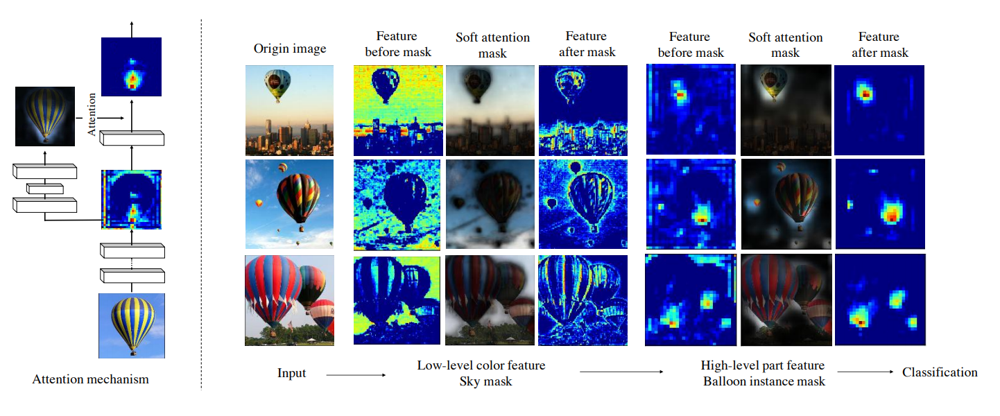
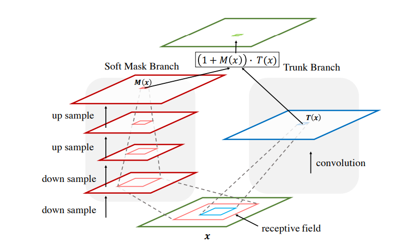

# Residual Attention Network for Image Classification

## 一、论文信息

论文地址：[Residual Attention Network for Image Classification](https://arxiv.org/abs/1704.06904) 
发表日期： 23 Apr 2017

商汤科技，清华大学和香港大学等联合出品，cvpr2017论文。

## 二、Attention简单介绍

### 1.人类注意力

当人的大脑接受到外部信息，如视觉信息、听觉信息时，往往不会对全部信息进行处理和理解，而只会将注意力集中在部分显著或者感兴趣的信息上，这样有助于滤除不重要的信息，而提升信息处理的效率。

### 2.注意力机制用于图像处理

深度学习中的Attention，源自于人脑的注意力机制。最早将Attention利用在图像处理上的出发点是，希望通过一个类似于人脑注意力的机制，只利用一个很小的感受野去处理图像中Attention的部分。而后来有人发现其实卷积神经网络自带Attention的功能，比如说在分类任务中，高层的feature map所激活的pixel也恰好集中在与分类任务相关的区域，也就是salience map，常被用在目标检测和图像分割上。

### 3.图像分类中使用注意力

- 序列学习

  序列学习将图像分类问题建模成序列学习问题。因此可以通过RNN和LSTM模型进行attention的学习。

- Region Proposal

  比如目标检测中的Faster RCNN的region proposal实际上就是注意力机制的应用。不过这种注意力学习是一种有监督的学习。

- Control gate

  通过Control gate来控制信息的流动也是注意力机制的体现。这个在LSTM中用得非常多。

在如何利用Attention来提升模型在分类任务上的性能的问题上，本文提供了一种新的思路。

## 三、创新点

首先看作者所说本文的三大贡献：

1. **堆叠的网络结构**。Residual Attention Network堆叠了多个Attention Module。作者说这种堆叠方式使得不同的Attention Module可以捕捉不同类型的注意力。
2. **注意力残差学习**（Attention Residual Learning）。简单地将Attention Module进行叠加反而会使网络的性能变差，所以本文提出了和ResNet思想类似的注意力残差学习方法。
3. **Bottom-up和Top-down的前向Attention机制**。Bottom-up和Top-down实际上就是encoder和decoer的架构的另一种说法。这种架构在图像语义分割中已经使用得非常多。其他利用Attention的网络，往往需要在原有网络的基础上新增一个分支来提取Attention，并进行单独的训练，而本文提出的模型能够就在一个前向过程中就提取模型的Attention，使得模型训练更加简单。

## 四、模型

### 1.总体架构

网络是通过堆叠多个注意力模块组成的。每个注意力模块会被分成两个分支，mask分支和trunk分支。

**A.Trunk分支**

trunk分支就是特征提取网络，本文使用的是pre-activation Residual Unit，ResNeXt和Inception，当然使用其他网络也是可行的。

**B.Soft Mask 分支**

Soft Mask分支使用的是bottom-up top-down结构。作者说这种结构模仿了前向传播和反馈注意力过程。

**C.注意力模块的输出**

把Soft Mask分支与Trunk分支的输出结合起来，Soft Mask分支输出的Attention map中的每一个pixel值相当于对原始feature map上每一个pixel值的权重，它会增强有意义的特征，而抑制无意义的信息，因此，将Soft Mask 分支与Trunk 分支输出的feature map进行element-wised的乘法，就得到了一个weighted Attention map。

其中，i表示不同的空间位置，c表示channel。

在注意力模块中，attention mask的作用除了能作为特征选择器，还有作用是作为梯度更新滤波器（gradient update filter ）。mask的梯度可以表示如下：

其中，θ表示mask分支的参数， φ表示trunk分支的参数。这样使得mask分支可以阻止错误的梯度（来自于有噪声的label）更新主干分支的参数。因此，mask分支对噪声信息会比较Robust。

**D.多个注意力模块进行堆叠**

作者提到，如果只是使用一个注意力模块的话会有一些缺点：

1. 图片中通常有混乱的背景，复杂的场景和很大的物体表面变化，如果只是用一个注意力模块是很难对这些情况进行建模。
2. 只用一个注意力模块只会对特征进行一次修改，但是如果这个修改是错误的，之后的网络就无能为力了。因此使用多个注意力模块可以有纠正错误的机会。

使用多个注意力模块进行堆叠可以解决以上的问题。多个注意力模块进行堆叠可以学习到各种不同类型的注意力，下图展示出了热气球图像的不同类型的注意力。底层的sky mask减弱了背景的影响，而高层的balloon mask则增强了相应位置的特征。

### 2.注意力残差学习

尴尬的是，作者进行以上的设计之后，网络的性能反而变差。这是由于：

1.由于mask中元素的值是0-1之间的，因此mask和trunk分支进行element-wise相乘之后会导致数值越来越小。2.mask分支会破坏主干网络的性能，比如说破坏了ResNet中的identity mapping。

因此作者在得到了weighted Attention map之后又与原来Trunk Branch的feature map进行了一个element-wised相加的操作，这就和ResNet有异曲同工之妙，该层的输出由下面这个式子组成： 

其中M(x)为Soft Mask Branch的输出，F(x)为Trunk Branch的输出，那么当M(x)=0时，该层的输入就等于F(x)，因此该层的效果不可能比原始的F(x)差，这一点也借鉴了ResNet中恒等映射的思想，同时这样的加法，也使得Trunk Branch输出的feature map中显著的特征更加显著，增加了特征的判别性。这样，优化的问题解决了，性能的问题也解决了，因此通过将这种残差结构进行堆叠，就能够很容易的将模型的深度达到很深的层次，具有非常好的性能。

### 3.Soft Mask分支

Bottom-up Top-down的结构首先通过一系列pooling，逐渐增大模型的感受野。之前说过高层特征中所激活的Pixel能够反映Attention所在的区域，于是通过upsample将feature map的尺寸放大到与原始输入一样大（这里的upsample通过deconvolution来实现，可以利用bilinear interpolation 也可以利用deconvolution自己来学习参数，可参考FCN中的deconvolution使用方式），就将Attention的区域对应到输入的每一个pixel上，我们称之为Attention map。

另外需要特别注意的是，mask分支的输出是通过sigmoid压缩到0-1之间的。

## 五、实验

作者在ImageNet数据集上与ResNet、Inception-ResNet等一系列当下最优秀的方法进行了比较： 

作者使用了不同的Attention unit，得到了结果也比原始的网络有不少的提升，这也有力的证明了Attention的效果，以及作者这种Residual Attention学习的有效性。

## 六、我的看法

通过无监督的注意力学习对性能提升是会比较局限的。最好的方式就是提供更多的监督信息，即所谓有多少人工就有多少智能。比如像faster RCNN网络那样，region proposal的学习是有监督的，这样学习到的注意力会更加准确。