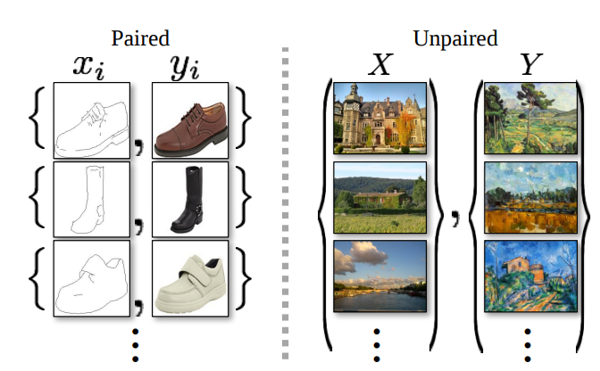
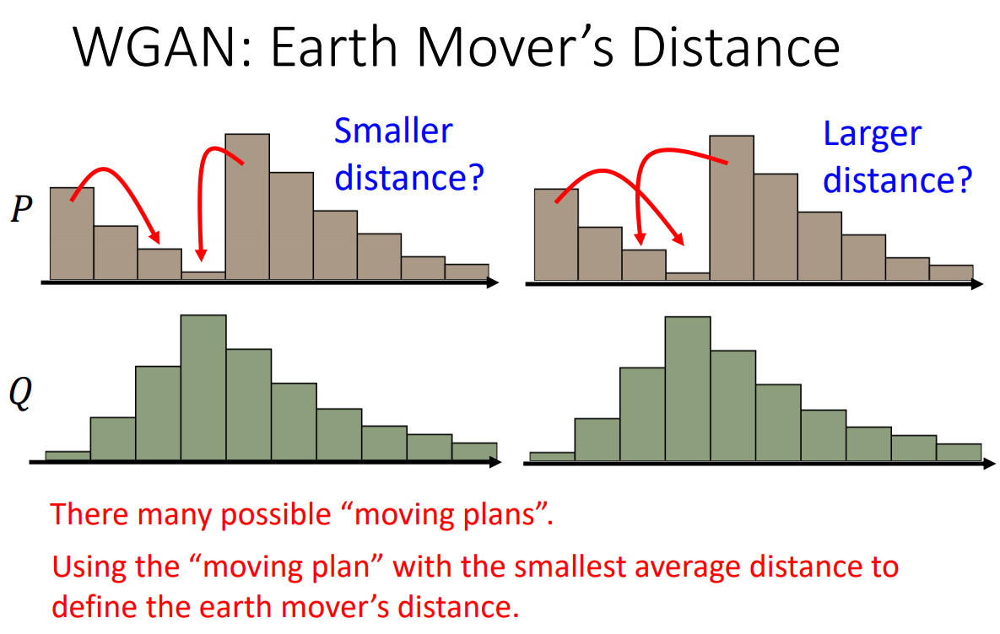
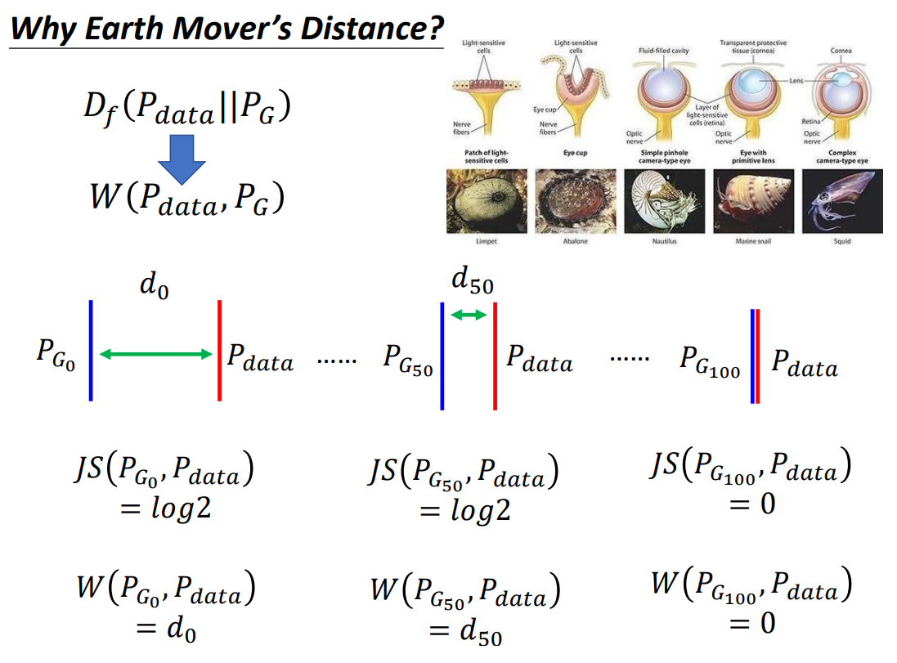
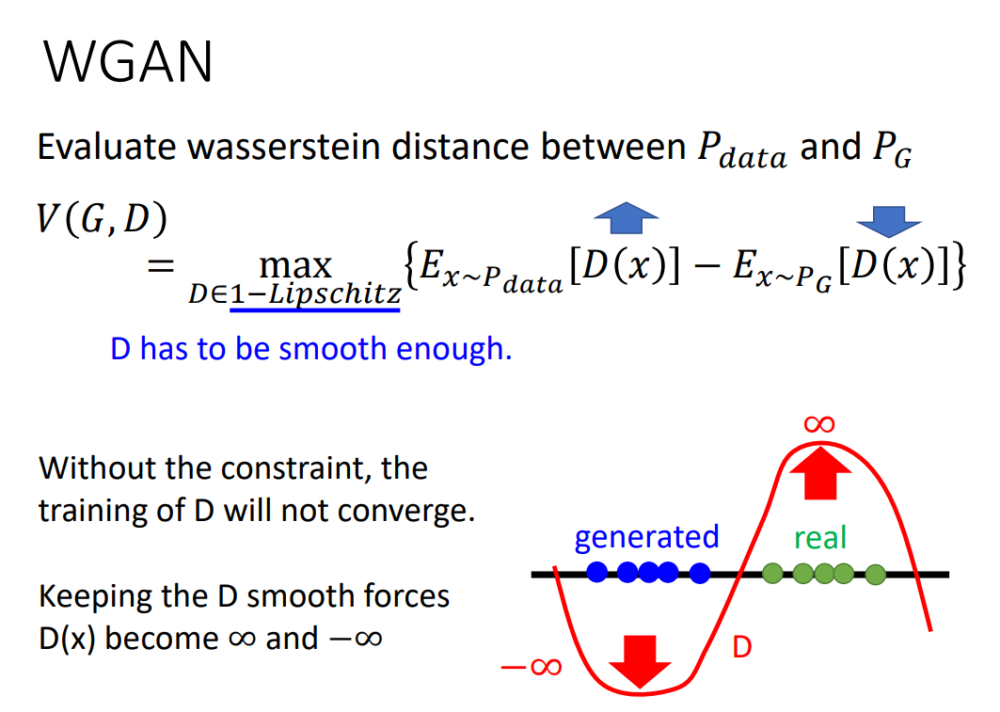
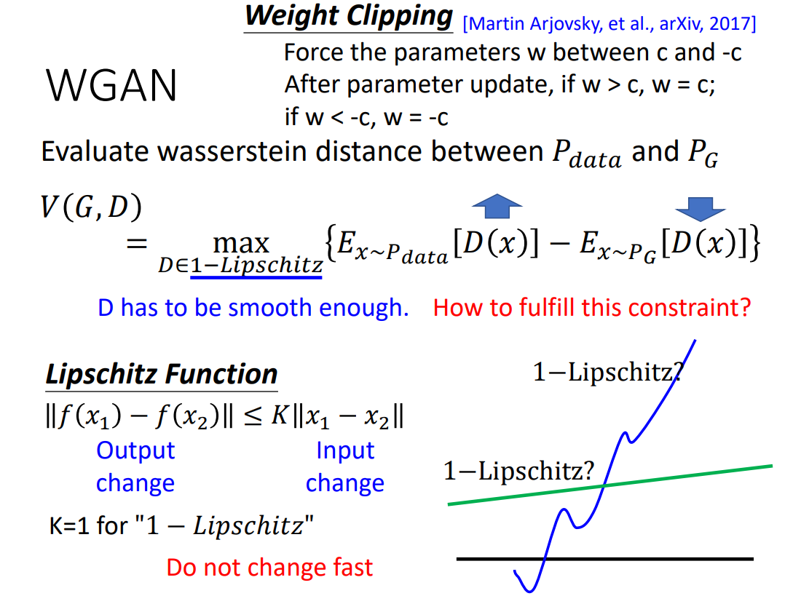
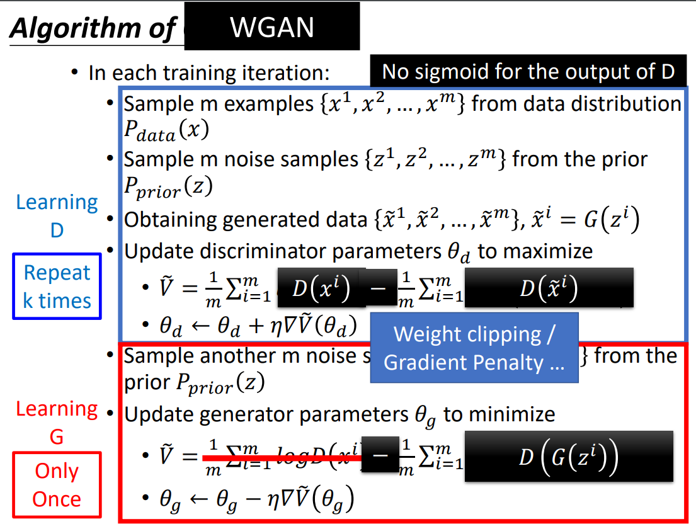

# CycleGAN

## 背景

Image-to-image translation（图像翻译，比如grayscale to color，image to semantic labels, edge-map to photograph）是计算机视觉中的一个难题，它需要学习输入图片和输出图片之间的映射，其中输入图片和输出图片之间通常都是对齐的图片对。但是在实际的任务中，图片对比较难以获得。所以这篇文章就提出一种方法，这种方法可以将图片从source domain到target domain之间做一个转换，但不需要图片对。

简单来说，学习一个映射G：X→Y，使G(X)生成的图片分布和Y的分布不可区分，这个可以使用对抗损失来做到。同时，考虑到这个映射是缺少限制的，所以又增加了一个反向的映射，F：Y→X，并且引入一个cycle consistency loss，使F(G(x))≈X。

各种实验结果表明了这种方法的有效性。

## 思想

对于图像翻译的任务，最直接的想法就是去学习一个映射学习一个映射G：X→Y，它能使domain X映射到domain Y。理论上，这个目标能使y^满足经验分布pdata(y)（一般来说，这个要求G是随机的？）。但是，这样的一个转换并不能保证输入x和输出y图片对的结果有意义，因为有无穷个G能y^的分布与Y分布一致。而且，在实践中，作者发现，很难独立地优化对抗目标：标准的训练过程很容易导致一个问题就是mode collapse，即所有的图片都映射到同样的输出图像，然后优化就不能再进行。

> Mode colaapse参考：https://blog.csdn.net/sparkkkk/article/details/72598041

对于这个问题，作者提出在目标上增加一个结构来解决。形式上，所以又增加了一个反向的映射，F：Y→X，并且引入一个cycle consistency loss，使F(G(x))≈X。

## Blog

https://hardikbansal.github.io/CycleGANBlog/

# WGAN

传统的GAN是用JS divergence来衡量PG和Pdata之间的相似性，但是JS存在一个非常严重的问题。这个问题的根源是：生成数据和真实数据不存在重叠。

为什么不重叠呢？

主要原因有两个：

1. 图片通常是在高维空间中的低维流形，所以基本上没有重叠。（为什么这样就没有重叠？）
2. 在两个distribution中进行sampling，由于sampling的数量不多，因此很可能没有重叠。

没有重合（不管重合多少，只要没有重合）情况会导致JS都是log2。因此根本没办法把PG0更新成PG1，因为都是log2。

怎么直观地理解这个问题？

我们训练一个二分类模型，只要生成数据和真实数据没有重叠，分类模型的loss都是一样的。（这样为什么会一样，这是由于sigmod决定的），而loss实际上就是衡量JS divergence的，所以这样就导致JS是一样的。

另外一种说明。

sigmoid在两端会很平，因为这些平的地方的梯度接近0的，因此很难将蓝色点往右边移动。

有一个做法就是不要把分类器训练的太好，这样就能保有一定的梯度。但是现在有一个问题就是，怎么样算train得不要太好？这样很难控制。所以GAN的早期很难train的。

后来的做法，把sigmoid换成linear，也就是把分类问题转换成了一个回归问题，目标是1和0，这样就可以保有一定的gradient。

而Wassertein GAN用另外一种衡量概率分布相似性的东西，叫做EM distance，以此来取代JS divergence。

以下是最简单的方式，就只要把相同的土移动一段距离d就好了。

但是实际情况会更复杂，移动的情况会很多，EM distance的意思就是穷举出所有的移土的计划，找最小的那个就是EM distance。

最好的移动策略就是下图：

下面是一个更严格的定义：

一个moving plan可以用一个矩阵来表是，矩阵的每一个元素表示纵坐标的元素移动到横坐标位置上。

EM distance的计算是很麻烦的，因为需要解决一个min问题。

为什么使用Mover‘s Distance？

EM Distance比JS好的地方就是即使pg和pdata没有重叠，但是还可以衡量它们之间的距离。

WGAN

现在的问题是，我们想用EM distance评估Pdata和PG之间的距离，那我们要怎么去改变discriminator。

式子就是下面这个，这个需要很多的证明，这里就暂时忽略了。

但是不能光光让它们越大或者越小，还必须满足D是一个1-Lipschitz距离。如果没有限制，且真实数据和generator产生没有重叠。这样没办法收敛。

添加限制：D必须平滑。

那么1-lipschitz是什么？

代表的意思是output变化不能大于输入的差距。

1-lipschitz这个限制不好加，那么就用weight clipping进行近似。这个做法限制了w的大小，w不能剧烈变化，因此能比较平滑。

但是实际上weight clipping并不能代表1-lipschitz，不过这种方法只是一种怪招，暂时解决问题而已。

