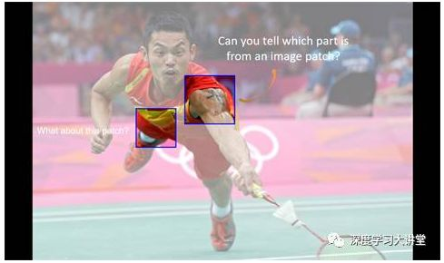
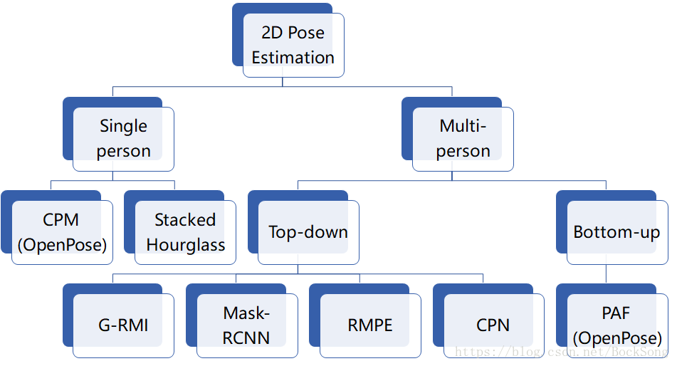
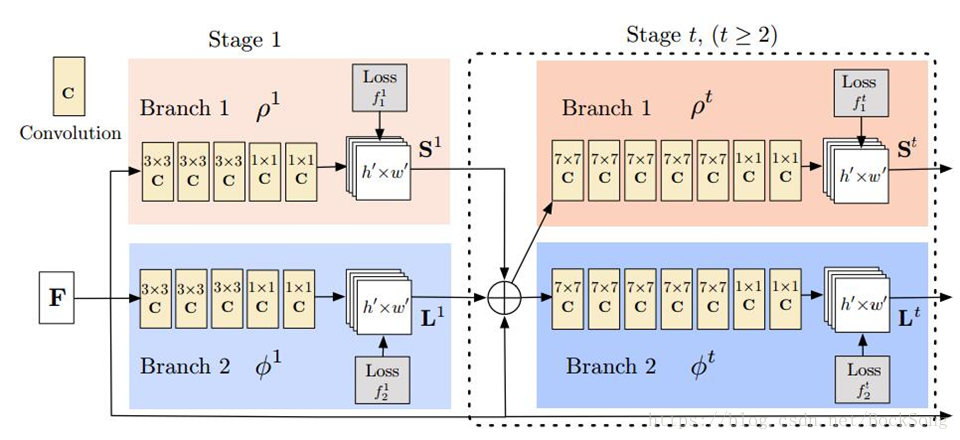
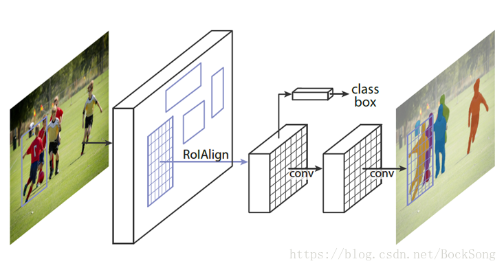
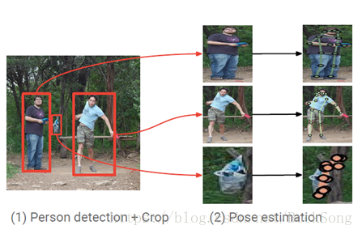
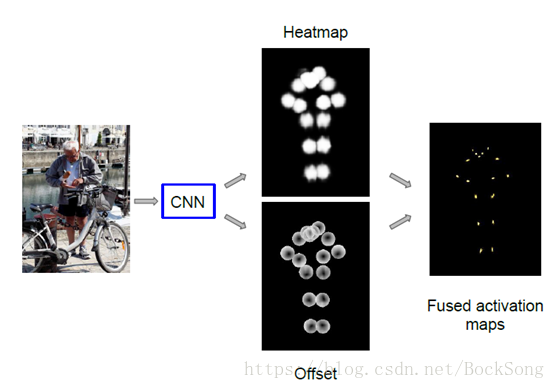
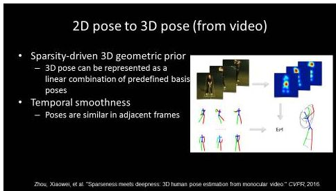

# 人体姿态识别综述

## 1. 什么是人体姿态识别

给定一幅图像或一段视频，人体姿态识别就是去恢复其中人体关节点位置的过程。根据输入图像的类型，人体姿态识别算法可以分为两类：**基于深度图**的算法、以及直接**基于RGB图像**的算法。相较于深度图对图像采集设备要求过高而带来的应用易受限的问题，基于RGB图像的人体姿态估计算法具有更广的应用前景，并且在学术上也取得了很好的成果。目前，即便是针对比较复杂的场景下，基于RGB图像的人体姿态估计算法也能达到很好的识别效果。

## 2. 应用

人体姿态识别有很多应用：比如行为识别、人机交互、游戏、动画以及衣服的识别等等。

## 3. 人体姿态识别挑战

在实际应用中，人体姿态识别也面临着几大问题，主要表现在三方面：

1. 人体的肢体运动比较灵活　
2. 视角的变化　
3. 衣着的变化

这三方面导致人体各个部位的视觉信息变化较大，从而为人体姿态识别技术带来了极大的挑战。

比如，以上图标出的两个区域为例，如果不看全图的效果，仅根据局部的视觉信息，人眼是几乎无法识别出它们分别属于身体哪些部位的；而加上全图上下文信息之后，识别起来就容易得多。从这个例子我们可以看出，仅局部信息在人体姿态识别中是不够的，我们需要利用全局信息来为人体姿态识别提供辅助。

## 4. 思路

对于人体姿态识别问题，我们既可将其看作**回归问题**，亦可以将其看作**检测问题**。这两者的区别在于，对于前者而言，我们期望得到的是精确的坐标值(x, y)；而对于后者而言，我们期望得到对应的热图。

采用回归的方式来解决人体姿态识别问题，效果并不理想。其主要原因有两方面：一方面是人体运动比较灵活，另一方面，回归模型的可扩展性较差，比较难于扩展到不定量的人体姿态识别问题中。因此，目前大家普遍使用的过渡处理方法是将其看作检测问题，从而获得一张热图。

## 5. 各方法简述

**总览**

### 5.1 单人检测

1. DeepPose

最早应用CNN的方法，直接回归关节坐标，multi-stage refine回归出的坐标。蓝色是卷积层，绿色是全连接层。

2. Flowing ConvNets

对于当前帧t及相邻的前后n帧使用全卷积网络为每帧输出一个预测的heatmap（去掉FC层），再用光流信息将这些heatmap扭曲到当前帧t。之后将warped的heatmap合并到另一个卷积层中，权衡来自附近框架的扭曲 heatmap。最后使用集合热图的**最大值**作为关节点。

对于视频流来说，info通常包括：appearance，当前帧+前一帧的关联信息，Structure。关键是利用图像序列和逐帧的信息。

3. CPM(convolution pose machine)

2016 年提出的 CPM 方法具有很强的鲁棒性,之后的很多方法是基于此改进的。CPM 的贡献在于使用顺序化的卷积架构来表达空间信息和纹理信息。网络分为多个阶段,每一个阶段都有监督训练的部分。前面的阶段使用原始图片作为输入,后面阶段使用之前阶段的特征图作为输入,主要是为了融合空间信息,纹理信息和中心约束。另外,对同一个卷积架构同时使用多个尺度处理输入的特征和响应,既能保证精度,又考虑了各部件之间的远近距离关系。

评测数据集：MPII，LSP，FLIC，在MPII数据集上的total PCKh是87.95%（如果加上LSP数据集作为训练，将达到88.52%），在LSP数据集上的PCKh是84.32%（如果加上MPII数据集作为训练，将达到90.5%），在FLIC数据集上的PCK@0.2分别是elbows（97.59%），wrist（95.03%）。速度不明，应该无法做到实时。

4. stacked hourglass ECCV 2016

同年发表的 stacked hourglass 也取得了非常不错的效果。对给定的单张 RGB 图像,输出人体关键点的精确像素位置,使用多尺度特征,捕捉人体各关节点的空间位置信息。网络结构形似沙漏状,重复使用 top-down 到 bottom-up 来推断人体的关节点位置。每一个 top-down到 bottom-up 的结构都是一个 hourglass 模块。

评测数据集：在FLIC数据集上的PCK@0.2分别elbows（99%），elbows（97%）； 
在MPII数据集上如下：Tompson就是flow convnet，Wei就是CPM 

### 5.2 多人检测

**两种思路**

自底向上：Bottom-to-up，先检测所有关节，再关联人。

自顶向下：Top-to-down，先检测人的bounding box，再用单人姿态估计方法检测每个人。

5. PAF(Realtime Multi-Person 2D Pose Estimation using Part Affinity Fields)

Branch1：计算置信图(CPM)

Branch2：计算亲和度PAF

一开始由VGG19生成feature map。每个stage结束后对该阶段的置信值，PAF图和一开始得到的Feature maps作concat分别作为下一阶段两个branches的输入。公式中，S为置信图，L为PAF，F是feature map. 原文自己说低分辨率和有遮挡时效果不够理想。
对关键点分组阶段，往往转换成图中的节点聚类问题，采用数学方法解决。

6. Mask R-CNN 

Faster R-CNN的基础上又加入了分割子网络，完成三个任务（检测+分类+分割）。mask R-CNN第二阶段有两条并行的分支，第一个分支是使用faster R-CNN的基础结构，对候选bounding box进行分类和bounding box坐标回归。第二个分支是对每一个RoI区域预测分割mask，结构上是一个小的FCN。

7. G-RMI

第一阶段使用faster rcnn检测出图片中的多个人，并对bounding box进行crop； 第二阶段采用fully convolutional resnet对每一个bounding box中的人物预测heatmap和offset； 最后通过heatmap和offset的融合得到关键点的精确定位 （如下）。

8. RMPE（现已更新到新版本AlphaPose，效果拔群）

识别姿态使用Stacked Hourglass. 致力于解决对于imperfect proposal，使得crop的person能够被单人姿态估计方法很好的识别，从而克服检测带来的定位误差。第一步获得human proposal第二步是将proposal输入到两个并行的分支里面，上面的分支是STN+SPPE+SDTN的结构，STN接收的是human proposal，SDTN产生的是pose proposal。下面并行的分支充当额外的正则化矫正器。第三步是对pose proposal做Pose NMS（非最大值抑制），用来消除冗余的pose proposal。

9. Associative Embedding 

论文特色：单阶段端对端的部位检测和组合。

关节点检测使用stacked hourglass，在原来的基础上每一次下采样时增加输出通道的个数，同时individual layers的残差模型改为3*3的卷积结构，其他结构不变。

关节点分组：使用stacked hourglass网络的输出是heatmap。与单人姿态估计网络输出的是单人的heatmap，而这里的heatmap包含了多人的关节点。再通过Associative Embedding 对个体的关节点进行组合。

10、CPN（18cvpr，**state-of-the-art**）

仍然是topdown思路，第一个stage检测可见的easy keypoint，第二个stage专门解决hard keypoint。

## 6. 视频中获取2D/3D信息

前文所讲的都是对于图片的，其实这种工作也可以扩展到视频中。

从视频来做三维姿态估计，应用到的很重要的点是，相邻帧之间的视觉信息应该是连续的，因而人的姿态在相邻帧之间的变化也会是连续的，因而可以利用这些信息的连贯性，来改进人体在3D或者2D中姿态识别的预测结果。

## 7. 参考

[人体姿态估计(Human Pose Estimation)文献综述](https://blog.csdn.net/BockSong/article/details/81037059)

[VALSE2017系列之三：人体姿态识别领域年度进展报告](https://zhuanlan.zhihu.com/p/27293180)

[人体姿态估计综述（Human Pose Estimation Overview）](https://blog.csdn.net/qq_36165459/article/details/78320535?locationNum=10&fps=1)