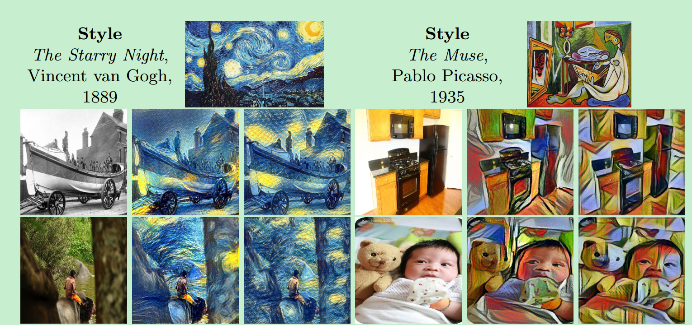
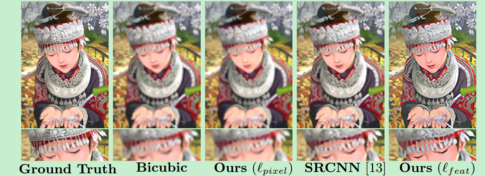

# Perceptual Losses

论文地址：[Perceptual Losses for Real-Time Style Transfer and Super-Resolution](https://arxiv.org/abs/1603.08155)

发表日期：Submitted on 27 Mar 2016

## 一、创新点

这篇文章主要考虑image transformation的问题，即输入一张图片，然后将这个图片转换到一个输出图片。对于这类问题：

1. 最近的解决方法就是去训练一个前馈网络，在输出和真实值之间使用per-pixel的损失。
2. 相关工作发现，将图片输入**预训练网络**，提取高层特征，然后在这个特征上计算感知损失函数（perceptual loss function）可以生成高质量的图片。

本文综合了两种方法，对于图像转换任务，提出使用感知损失函数来训练一个前馈网络。

主要考虑两个任务：

1. 图像风格迁移
2. 图像超分辨率

## 二、几个概念

### 1. 图像转换任务

图像处理领域（输入是一张degraded image）：

1. Denoising（noise->denoise）
2. 超分辨率(low resolution->high resolution)
3. Colorization上色(grayscale->color)

计算机视觉（输入是一张RGB图像）：

1. 语义分割
2. 深度估计

对于这类问题，最常用的方法是，训练一个前馈网络，使用per-pixel的损失函数来衡量网络输出和真实值的差异性。

这类方法的缺点：不能捕捉输出和真实值的感知差异（perceptual difference）。举个例子：

> 假设两张相同的图片互相之间只是偏移了一个像素，这个时候如果用per-pixel的损失函数，那么值会很大，但是用感知损失函数来算，就可能比较小。

### 2. 感知损失函数

最近的工作发现，可以通过感知损失函数来生成高质量的图片。感知损失函数的计算不是基于像素的，而是基于图像表示，更详细地说，就是通过图片输入到**预训练的CNN网络**中，提取相应的图像特征，然后计算损失。

具体来说：给一个已经训练好的网络，喂一张图片，得到高层的特征，将这个特征和真实值计算损失函数就是感知损失函数。

## 三、模型架构

模型包括两个部分，图像转换网络和损失网络。一张图像x输入到图像转换网络，输出生成图像$\hat{y}$，将生成图像$\hat{y}$，风格图像$y_s$，内容图像$y_c$分别输入到损失网络，计算相应的Gram矩阵和特定层特征，再计算风格损失和内容损失。训练过程中损失网络权重不更新，图像转换网络权重更新，最终可以生成合成图像$y_s$ 。

### 1. 图像转换网络

图像转换网络是作者重新设计的，主要的特点如下：

1. 输入输出大小。对于风格迁移：输入和输出都是3×256×256。超分辨率：输入3 × 288/f × 288/f，输出3×288×288，其中f表示上采样倍数。
2. 网络包括上采样和下采样部分，实际上就是encoder-decoder架构。
3. 使用了残差连接。
4. 对于风格迁移和超分辨率，网络架构的细节有差异。

### 2. 损失网络

使用16层的VGG网络进行特征提取，网络预先通过imageNet训练好，所以训练的时候参数是不更新的。特征提取之后，就可以计算内容损失或者风格损失。

**简单的损失函数**

Piexel loss：当对于网络的预测$\hat{y}$ 有相应的目标$y$，这个时候可以去计算逐像素的损失。这个在下文的图像超分辨率中会用到。

Total Variation Regularization：为了使得生成的图像在空间上更加平滑，会计算一个Total Variation Regularization损失，不过这篇文章中没有讲这个损失是如何计算的，只是提到了4篇参考文献。 

### 四、实验

实验主要包括风格迁移和单图像的超分辨率。

#### 1. 风格迁移

使用VGG-16网络。

内容损失使用relu3_3计算。 

风格损失通过$relu1\_2$, $relu2\_2$, $relu3\_3$, and $relu4\_3$计算。

实验结果：

与论文 *A neural algorithm of artistic style*的对比：

#### 2. 图像超分辨率

图像超分辨率是一个病态问题，因为对于每张图片都可以对应多张高分辨率的图片。当超分辨率的倍数增大的时候这个问题变得更加严重。对于大的因子(x4,x8)，在低分辨率图像中存在很少可以恢复高分辨率图像的细节信息。

为了解决这个问题，使用特征重构损失来计算super-resolution networks的损失，而不是计算per-pixel loss。这样可以将预训练网络得到的语义信息迁移到super-resolution networks中。本篇文章主要集中在对(x4和x8超分辨率的研究中，因为更大的因子需要对输入图片进行更具语义信息的推断。

细节

> 1. x4和x8的超分辨率
> 2. 使用VGG-16的relu2_2进行特征重构
> 3. 使用MsCOCO数据进行训练，输出的图片大小是288x288，输入图片通过高斯模糊和bicubic interpolation进行下采样得到。
> 4. 后处理，将网络的输出和低分辨率的输入进行直方图匹配（histogram matching）

**实验结果**

x4的结果

x8的结果

