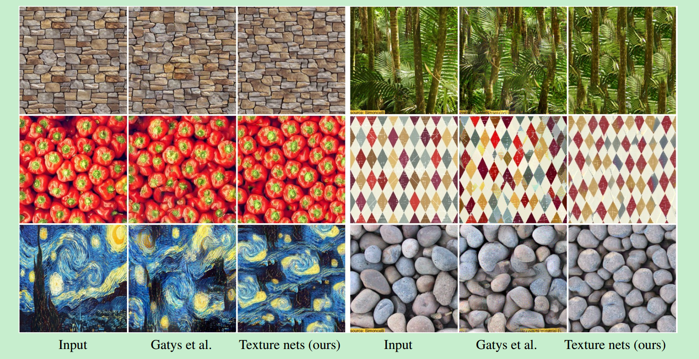
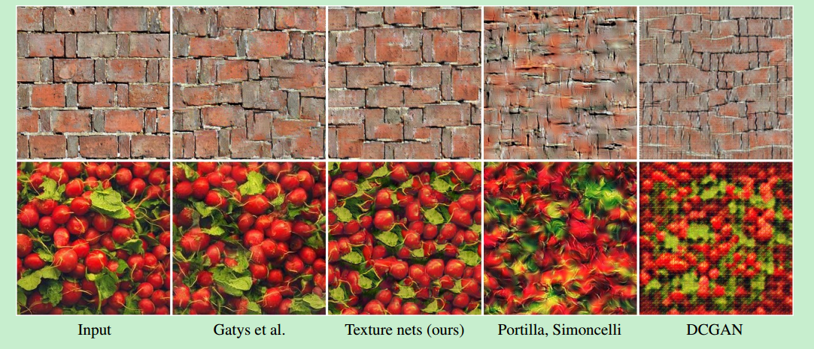
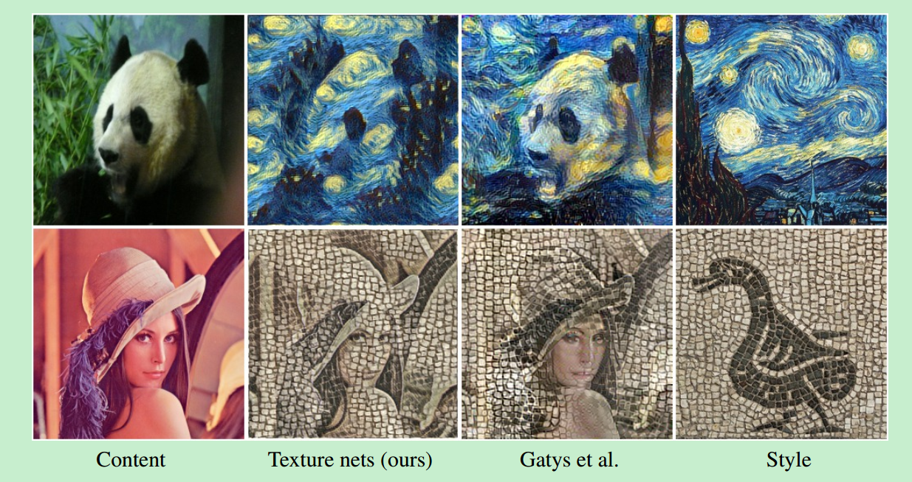
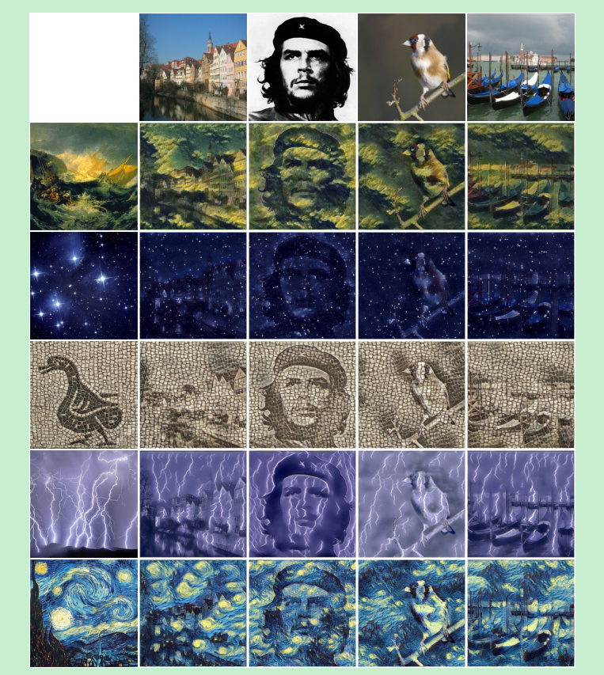

# Texture Networks

论文地址：[Texture Networks: Feed-forward Synthesis of Textures and Stylized Images](https://arxiv.org/abs/1603.03417)

发表日期：Submitted on 10 Mar 2016

## 一、创新点

1. Gatys提出的风格迁移方法太慢，本文提出的方法将计算负担都放到学习阶段，因此测试阶段速度大大加快。
2. 给定一张图片，可以产生具有相同纹理**任意大小**的**多张图片**。质量与Gatys可比，但时间快几百倍。

本文的主要贡献有以下几点：

第一，首次证实生成方法能产生质量和多样性与Gatys等人提出的方法相媲美的效果。

第二，提出的生成方法能做到两个数量级的提速和一个数量级的内存效率提升。用一个单一前馈网络带来的高性能，使得将风格化转移到视频及手机应用上变得可能。

第三，设计了一个非常适合风格化任务的多尺度生成器结构。

## 二、方法

### 1. 整体网络架构

本文设计的网络架构称为纹理网络（texture networks），其中纹理网络包括生成器网络和描述网络。

对于纹理生成而言，生成器网络$g$吃噪声$z$，产生纹理图片$g(z)$。

对于风格迁移而言，生成器网络$g$吃噪声$z$和内容图片$y$，吐出来风格迁移图片$g(y,z)$。

整个网络只适用一种风格，并且能够产生任意数量任意大小的图片。

问题的关键是：如何构建loss function，使得生成器网络能够产生纹理或者风格迁移图像。

### 2. 生成器网络用于纹理合成

生成器网络最简单的设计就是：将卷积层进行叠加，使用非线性激活函数。网络吃进去一个噪声，进行上采样，最终产生一张图片。但是作者发现，多尺度的架构可以使纹理损失函数值更小，并且在参数量更少的情况下可以得到更好的生成图片质量，训练也更快。因此本文就采用了多尺度输入的架构。具体描述如下：

生成器网络：

- 输入的随机噪声图片大小是按照一定排布的。假设纹理图片是$M*M*3$的大小，那么，输入噪声$z$大小则是$M/2^i*M/2^i,i=1,2,...,K$ ，本文中设置$K=5, M=256$ 。

- 噪声$z$采样于均匀分布，其中各元素独立同分布。噪声会经过一些卷积操作和非线性激活函数操作，然后上采样扩大两倍，最终与相应的层进行concate。上采样层使用最近邻插值。
- convolution block：三个卷积层，分别包括3 × 3, 3 × 3和1 × 1 filters。

- 网络最终通过一个1x1卷积得到最终的RGB图像$x$。

**生成器网络的学习**

生成器网络吃进去噪声，生成相应的图片。将该图片送入描述网络，计算得到Gram矩阵，同时，也将纹理图片送入描述网络，计算相应的Gram矩阵。计算两个Gram矩阵的loss即可。

整个过程中，生成器网络的参数会通过SGD不断更新，但是描述网络的参数是固定的（使用预训练网络的权重，比如VGG16的在ImageNet上的训练得到的网络参数），不更新。

### 3. 生成器网络用于风格迁移

在风格迁移任务上，生成器网络架构有一点变化，即将生成器网络的输入进行改变。生成器网络的输入将不仅仅是噪声$z$，还增加了内容图片$y$的输入。噪声$z$将会与进行下采样的内容图像$y$进行concate之后再输入到生成器网络中。在计算损失的时候，增加了内容损失。其他方面与纹理合成相同。

## 三、实验

纹理生成的结果：

与Gatys的对比：

与其它方法的对比：

风格迁移

与Gatys的对比：

其它实验结果：

