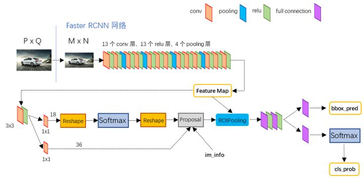
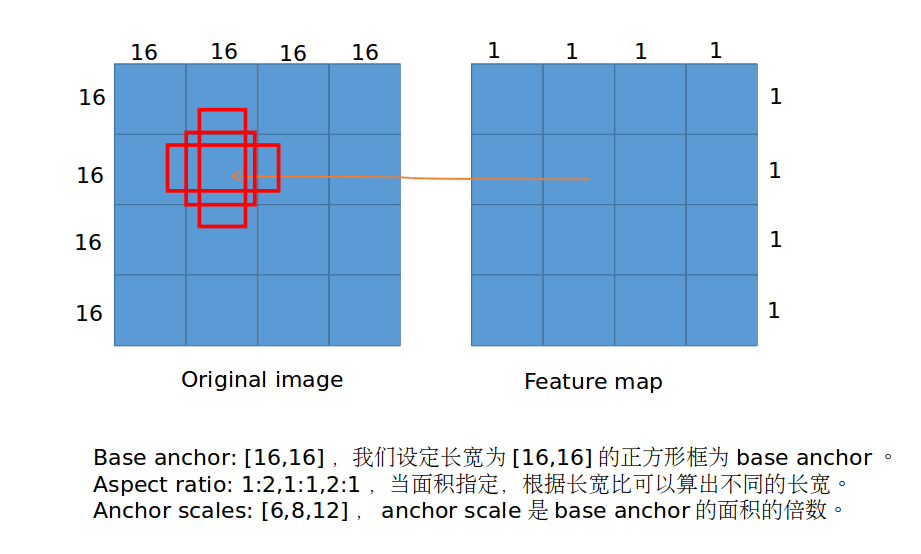
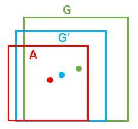
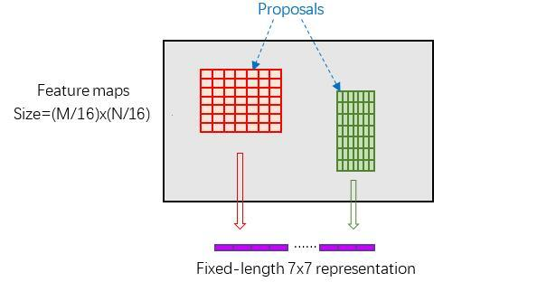
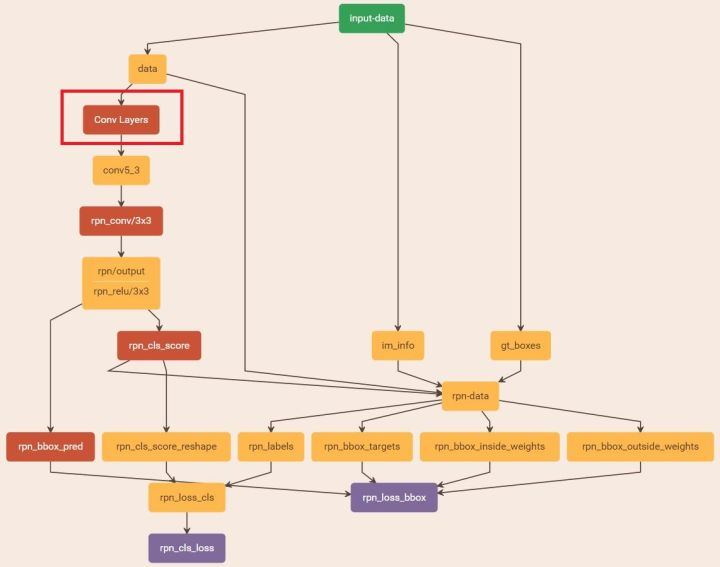
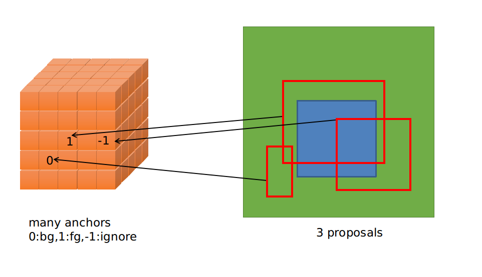
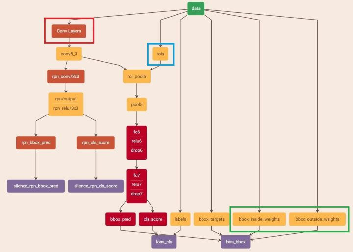

### Faster RCNN

论文地址：https://arxiv.org/abs/1506.01497

#### 1 创新点

1. 利用Region proposal network（RPN）代替传统的selective search等方法来产生region proposals。
2. RPN与detection network共享卷积层，大大缩减了计算时间。
3. 引入anchor机制进行bounding box的分类和回归。

#### 2 思想

 

​	之前的一些目标检测方法，生成region proposal通常非常耗时，比如Selective search。基于此，本文提出region poposal network来学习生成region proposal。RPN与检测网络共享了卷积层，因此可以大大节约计算开销。此外，本文还提出利用多种尺度和长宽比的anchor来进行bounding box的分类和回归，anchor本质上就是图像上的sliding window，只是取代了fast RCNN中的selective search，节省了大量时间。

#### 3 模型

​													
$$
图1
$$
Faster R-CNN可以分为4个主要内容：

1. Conv layers。作为一种CNN网络目标检测方法，Faster R-CNN首先使用一组基础的conv+relu+pooling层提取image的feature maps。该feature maps被共享用于后续RPN层和全连接层。
2. Region Proposal Networks。RPN网络用于生成region proposals。该层通过softmax判断anchors属于foreground或者background，再利用bounding box regression修正anchors获得精确的proposals。
3. Roi Pooling。该层收集输入的feature maps和proposals，综合这些信息后提取proposal feature maps，送入后续全连接层判定目标类别。
4. Classification。利用proposal feature maps计算proposal的类别，同时再次bounding box regression获得检测框最终的精确位置。

以下以上述4个内容作为切入点介绍Faster R-CNN网络。

​												 
$$
图2
$$
​	图2展示了基于VGG16模型的faster RCNN网络结构，可以清晰的看到：

1. 该网络对于一副任意大小PxQ的图像，首先缩放至固定大小MxN，然后将MxN图像送入网络；
2. Conv layers中包含了13个conv层+13个relu层+4个pooling层；
3. RPN网络首先经过3x3卷积，再分别生成foreground anchors与bounding box regression偏移量，然后计算出proposals；
4. Roi Pooling层则利用proposals从feature maps中提取proposal feature送入后续全连接和softmax网络作classification（即分类proposal到底是什么object）。

##### I.Conv layers

​	Conv layers包含了conv，pooling，relu三种层。如图2，Conv layers部分共有13个conv层，13个relu层，4个pooling层。这里有一个非常容易被忽略但是又无比重要的信息，在Conv layers中：

1. 所有的conv层都是：kernel_size=3，pad=1
2. 所有的pooling层都是：kernel_size=2，stride=2

  为何重要？在Faster RCNN Conv layers中对所有的卷积都做了扩边处理（pad=1，即填充一圈0），导致原图变为(M+2)x(N+2)大小，再做3x3卷积后输出MxN。正是这种设置，导致Conv layers中的conv层不改变输入和输出矩阵大小。如图3：

$$
图3
$$
​	

类似的是，Conv layers中的pooling层kernel_size=2，stride=2。这样每个经过pooling层的MxN矩阵，都会变为(M/2)*(N/2)大小。综上所述，在整个Conv layers中，conv和relu层不改变输入输出大小，只有pooling层使输出长宽都变为输入的1/2。那么，一个MxN大小的矩阵经过Conv layers固定变为(M/16)x(N/16)！这样Conv layers生成的feature map中都可以和原图对应起来。

##### II.Region proposal network(RPN)

$$
图4
$$
​	上图4展示了RPN网络的具体结构。可以看到RPN网络实际分为2条线，上面一条通过softmax分类anchors获得foreground和background（检测目标是foreground），下面一条用于计算对于anchors的bounding box regression偏移量，以获得精确的proposal。而最后的Proposal层则负责综合foreground anchors和bounding box regression偏移量获取proposals，同时**剔除太小和超出边界**的proposals。整个网络到了Proposal Layer这里，就完成了相当于目标定位的功能。

​	RPN中有几个比较重要的注意点，下面一一讲解。

**1.Anchors**

​	anchors，实际上就是一组由generate_anchors.py生成的矩形。直接运行作者demo中的generate_anchors.py可以得到以下输出：

~~~python
[[ -84.  -40.   99.   55.]
 [-176.  -88.  191.  103.]
 [-360. -184.  375.  199.]
 [ -56.  -56.   71.   71.]
 [-120. -120.  135.  135.]
 [-248. -248.  263.  263.]
 [ -36.  -80.   51.   95.]
 [ -80. -168.   95.  183.]
 [-168. -344.  183.  359.]]
~~~

​	其中每行的4个值[x1,y1,x2,y2]代表矩形左上和右下角点坐标。9个矩形共有3种形状，长宽比为大约为：width:height = [1:1, 1:2, 2:1]三种，如图6。实际上通过anchors就引入了检测中常用到的**多尺度方法**。

​	
$$
图5
$$
​	注：关于上面的anchors size，其实是根据检测图像设置的。在python demo中，会把任意大小的输入图像reshape成800x600（即图2中的M=800，N=600）。再回头来看anchors的大小，anchors中长宽1:2中最大为352x704，长宽2:1中最大736x384，基本是cover了800x600的各个尺度和形状。

​	在实际的代码中，会设置一个base anchor，长宽为[16,16]，根据这个可以计算出来它的面积。而anchor scale指的是base anchor面积的倍数，通常选取[6,8,12]三种anchor scale。在某种anchor scale下还有三种aspect ratio，通常选取[1:2,1:1,2:1]，也就说，在面积一定的情况下，根据不同的长宽比可以设置不同形状的长方形（包括正方形）。下图以anchor scale=1，aspect ratio分别为1:1,2:1,1:2为例画出了三个anchor，其他情况类似。

$$
图6
$$
​	那么这9个anchors是做什么的呢？如图7，遍历Conv layers计算获得的feature maps，为每一个点都配备这9种anchors作为初始的检测框。这样做获得检测框很不准确，不用担心，后面还有2次bounding box regression可以修正检测框位置。

$$
图7
$$

解释一下上面这张图的数字。

1. 在原文中使用的是ZF model中，其Conv Layers中最后的conv5层num_output=256，对应生成256张特征图，所以相当于feature map每个点都是256-dimensions
2. 在conv5之后，又做了3x3卷积且num_output=256，相当于每个点又融合了周围3x3的空间信息（为什么这么做？），同时256-d不变。
3. 假设在conv5 feature map中每个点上有k个anchor（默认k=9），而每个anhcor要分foreground和background，所以每个点由256d feature转化为cls=2k scores；而每个anchor都有[x, y, w, h]对应4个偏移量，所以reg=4k coordinates
4. 补充一点，全部anchors拿去训练太多了，训练程序会在合适的anchors中**随机**选取128个postive anchors+128个negative anchors进行训练。

注意，在本文讲解中使用的VGG conv5 num_output=512，所以是512d，其他类似.....

**2.Softmax判定foreground与background**

​	一个MxN大小的矩阵送入Faster RCNN网络后，到RPN网络变为(M/16)x(N/16)，不妨设W=M/16，H=N/16。在进入reshape与softmax之前，先做了1x1卷积，如图8：

$$
图8
$$
​	该1x1卷积的num_output=18，也就是经过该卷积的输出图像为WxHx18大小（注意第二章开头提到的卷积计算方式）。这也就刚好对应了feature maps每一个点都有9个anchors，同时每个anchors又有可能是foreground和background，所有这些信息都保存WxHx(9x2)大小的矩阵。为何这样做？后面接softmax分类获得foreground anchors，也就相当于初步提取了检测目标候选区域box（一般认为目标在foreground anchors中）。

​	那么为何要在softmax前后都接一个reshape layer？其实只是为了便于softmax分类，至于具体原因这就要从caffe的实现形式说起了。在caffe基本数据结构blob中以如下形式保存数据：

~~~yaml
blob=[batch_size, channel，height，width]
~~~

​	对应至上面的保存bg/fg anchors的矩阵，其在caffe blob中的存储形式为[1, 2x9, H, W]。而在softmax分类时需要进行fg/bg二分类，所以reshape layer会将其变为[1, 2, 9xH, W]大小，即单独“腾空”出来一个维度以便softmax分类，之后再reshape回复原状。注意：这个只是针对caffe而言，tensorflow的操作不同于caffe。

​	综上所述，RPN网络中利用anchors和softmax初步提取出foreground anchors作为候选区域。

**3.Bounding box regression原理**

​	介绍bounding box regression数学模型及原理。如图9所示绿色框为飞机的Ground Truth(GT)，红色为提取的foreground anchors，那么即便红色的框被分类器识别为飞机，但是由于红色的框定位不准，这张图相当于没有正确的检测出飞机。所以我们希望采用一种方法对红色的框进行微调，使得foreground anchors和GT更加接近。

$$
图9
$$
​	对于窗口一般使用四维向量(x, y, w, h)表示，分别表示窗口的中心点坐标和宽高。

$$
图10
$$
​	对于图 10，红色的框A代表原始的Foreground Anchors，绿色的框G代表目标的GT，我们的目标是寻找一种关系，使得输入原始的anchor A经过映射得到一个跟真实窗口G更接近的回归窗口G'，即：

先做平移：

 

再做缩放：

观察上面4个公式发现，需要学习的是$d_{x}(A),d_{y}(A),d_{w}(A),d_{h}(A)$这四个变换。当输入的anchor A与GT相差较小时，可以认为这种变换是一种线性变换， 那么就可以用线性回归来建模对窗口进行微调（注意，只有当anchors A和GT比较接近时，才能使用线性回归模型，否则就是复杂的非线性问题了）。

接下来的问题就是如何通过线性回归获得 $d_{x}(A),d_{y}(A),d_{w}(A),d_{h}(A) $ 了。线性回归就是给定输入的特征向量X, 学习一组参数W, 使得经过线性回归后的值跟真实值Y非常接近，即$Y=WX$。对于该问题，输入X是一张经过卷积获得的feature map，定义为$Φ$；同时还有训练传入的GT，即$t_{x}, t_{y}, t_{w}, t_{h}$。输出是$d_{x}(A),d_{y}(A),d_{w}(A),d_{h}(A)$四个变换。那么目标函数可以表示为：

​	其中$Φ(A)$是对应anchor的feature map组成的特征向量，$W$是需要学习的参数，$d(A)$是得到的预测值（*表示 x，y，w，h，也就是每一个变换对应一个上述目标函数）。为了让预测值$t_{x}, t_{y}, t_{w}, t_{h}$与真实值差距最小，设计损失函数：

​	函数优化目标为：

​	需要说明，只有在GT与需要回归框位置比较接近时，才可近似认为上述线性变换成立。

说完原理，对应于Faster RCNN原文，foreground anchor与ground truth之间的平移量 $(t_x, t_y)$ 与尺度因子 $(t_w, t_h) $如下：

​	对于训练bouding box regression网络回归分支，输入是cnn feature $Φ$，监督信号是Anchor与GT的差距 $(t_x, t_y, t_w, t_h)$，即训练目标是：输入$Φ$的情况下使网络输出与监督信号尽可能接近。

​	那么当bouding box regression工作时，再输入$Φ$时，回归网络分支的输出就是每个Anchor的平移量和变换尺度 $(t_x, t_y, t_w, t_h)$，显然即可用来修正Anchor位置了。

**4. 对Proposals进行bounding box regression**

​	在了解bounding box regression后，再回头来看RPN网络第二条线路，如图11

$$
图11
$$
可以看到其num_output=36，即经过该卷积输出图像为WxHx36，这里相当于feature maps每个点都有9个anchors，每个anchors又都有4个用于回归的$d_{x}(A),d_{y}(A),d_{w}(A),d_{h}(A)$变换量。

**5.Proposal layer**

​	Proposal Layer负责综合所有 $d_{x}(A),d_{y}(A),d_{w}(A),d_{h}(A)$变换量和foreground anchors，计算出精准的proposal，送入后续RoI Pooling Layer。先看图12：

$$
图12
$$
​	Proposal Layer有3个输入：fg/bg anchors分类器结果rpn_cls_prob_reshape，对应的bbox reg的$d_{x}(A),d_{y}(A),d_{w}(A),d_{h}(A)$变换量，以及im_info；另外还有参数feat_stride=16。

​	首先解释im_info。对于一副任意大小PxQ图像，传入Faster RCNN前首先reshape到固定MxN，im_info=[M, N, scale_factor]则保存了此次缩放的所有信息。然后经过Conv Layers，经过4次pooling变为WxH=(M/16)x(N/16)大小，其中feature_stride=16则保存了该信息，用于计算anchor偏移量。

$$
图13
$$
Proposal Layer按照以下顺序依次处理：

1. 生成anchors，利用$d_{x}(A),d_{y}(A),d_{w}(A),d_{h}(A)$对所有的anchors做bbox regression回归（这里的anchors生成和训练时完全一致）
2. 按照输入的foreground softmax scores由大到小排序anchors，提取前pre_nms_topN(e.g. 6000)个anchors，即提取**修正位置后**的foreground anchors。
3. 限定超出图像边界的foreground anchors为图像边界（防止后续roi pooling时proposal超出图像边界）。
4. 剔除非常小（width<threshold or height<threshold）的foreground anchors。
5. 进行nonmaximum suppression。
6. 再次按照nms后的foreground softmax scores由大到小排序fg anchors，提取前post_nms_topN(e.g. 300)结果作为proposal输出**（注意：这一步在tensorflow的代码中是可选的，也就是说不一定要进行这个操作！）**

之后输出proposal=[x1, y1, x2, y2]，注意，由于在第三步中将anchors映射回原图判断是否超出边界，所以这里输出的proposal是对应MxN输入图像尺度的，这点在后续网络中有用。严格意义上的检测应该到此就结束了，后续部分应该属于识别了。

RPN网络结构就介绍到这里，总结起来就是：

生成anchors -> softmax分类器提取fg anchors -> bbox reg回归fg anchors -> Proposal Layer生成proposals

**注意：proposal是对应原图的，不是对应feature map的，因此得到proposal之后，要将其转为到feature map中的proposal，再将其喂给ROI pooling进行进一步的操作！**

##### III.ROI Pooling

​	RoI Pooling层负责收集proposal，并计算出proposal feature maps，送入后续网络。从图2中可以看到Rol pooling层有2个输入：

1. 原始的feature maps
2. RPN输出的proposal boxes（大小各不相同）

**1.为何需要RoI Pooling**

​	对于传统的CNN（如AlexNet，VGG），当网络训练好后输入的图像尺寸必须是固定值，同时网络输出也是固定大小的vector or matrix。如果输入图像大小不定，这个问题就变得比较麻烦。有2种解决办法：

1. 从图像中crop一部分传入网络
2. 将图像warp成需要的大小后传入网络

$$
图14
$$
​	两种办法的示意图如上图14，可以看到无论采取那种办法都不好，要么crop后破坏了图像的完整结构，要么warp破坏了图像原始形状信息。

​	回忆RPN网络生成的proposals的方法：对foreground anchors进行bounding box regression，那么这样获得的proposals也是大小形状各不相同，即也存在上述问题。所以Faster R-CNN中提出了RoI Pooling解决这个问题。

**2.RoI Pooling原理**

在之前有明确提到：proposal=[x1, y1, x2, y2]是对应MxN尺度的，所以首先使用spatial_scale参数将其映射回(M/16)x(N/16)大小的feature maps尺度；之后将每个proposal水平和竖直分为pooled_w和pooled_h份，对每一份都进行max pooling处理。这样处理后，即使大小不同的proposal，输出结果都是7x7大小，实现了fixed-length output（固定长度输出）。

$$
图15
$$

##### VI.Classification

​	Classification部分利用已经获得的proposal feature maps，通过full connect层与softmax计算每个proposal具体属于那个类别（如人，车，电视等），输出cls_prob概率向量；同时再次利用bounding box regression获得每个proposal的位置偏移量bbox_pred，用于回归更加精确的目标检测框。Classification部分网络结构如图15。

$$
图16
$$

从PoI Pooling获取到7x7=49大小的proposal feature maps后，送入后续网络，可以看到做了如下2件事：

1. 通过全连接和softmax对proposals进行分类，这实际上已经是识别的范畴了。
2. 再次对proposals进行bounding box regression，获取更高精度的rect box。

#### 4训练

Faster RCNN训练可以分为两种方式，一种是循环迭代法。另外一种是end-to-end方法。

这里介绍循环迭代法，end-to-end方法实际上就是将RPN和fast RCNN一起训练。

​	Faster R-CNN的训练，是在已经训练好的model（如VGG_CNN_M_1024，VGG，ZF）的基础上继续进行训练。实际中训练过程分为6个步骤：

1. 在已经训练好的model上，训练RPN网络。

2. 利用步骤1中训练好的RPN网络，收集proposals。

3. 第一次训练Fast RCNN网络。

4. 第二训练RPN网络。

5. 再次利用步骤4中训练好的RPN网络，收集proposals。

6. 第二次训练Fast RCNN网络。

​        可以看到训练过程类似于一种“迭代”的过程，不过只循环了2次。至于只循环了2次的原因是应为作者提到："A similar alternating training can be run for more iterations, but we have observed negligible improvements"，即循环更多次没有提升了。

**注意RPN网络和fast RCNN网络是共享conv层的，所以需要进行迭代训练。每次训练，conv层的权重都有更新。**

接下来讲解以上述6个步骤训练过程。

##### I.训练RPN网络

​	在该步骤中，首先读取RBG提供的预训练好的model（本文使用VGG），开始迭代训练。先看网络结构，如图17。

$$
图17（考虑图片大小，Conv Layers中所有的层都画在一起了，如红圈所示，后续图都如此处理）
$$

$$
图18
$$
与检测网络类似的是，依然使用Conv Layers提取feature maps。整个网络使用的Loss如下：

​	上述公式中，i表示anchors index， $p_{i}$ 表示foreground softmax predict概率，$p_{i}^{*}$代表对应的GT predict概率（即当第i个anchor与GT间IoU>0.7，认为是该anchor是foreground，$p_{i}^{*}=1$；反之IoU<0.3时，认为是该anchor是background，$p_{i}^{*}=0$；至于那些0.3<IoU<0.7的anchor则不参与训练，如图18所示）；$t$代表predict bounding box，$t^{*}代$表对应foreground anchor对应的GT box。可以看到，整个Loss分为2部分：

1. cls loss，即rpn_cls_loss层计算的softmax loss，用于分类anchors为forground与background的网络训练
2. reg loss，即rpn_loss_bbox层计算的soomth L1 loss，用于bounding box regression网络训练。注意在该loss中乘了$p_{i}^{*}$，相当于只关心foreground anchors的回归（其实在回归中也完全没必要去关心background）。

   由于在实际过程中，$N_{cls}$和$N_{reg}$差距过大，用参数λ平衡二者（如$N_{cls}$=256，$N_{reg}$=2400时设置λ=10），使总的网络Loss计算过程中能够均匀考虑2种Loss。这里比较重要是Lreg使用的soomth L1 loss，计算公式如下：

##### II.通过训练好的RPN网络收集proposals

​	在该步骤中，利用之前的RPN网络，获取proposal rois，同时获取foreground softmax probability，如图19。该网络本质上和检测中的RPN网络一样，没有什么区别。

$$
图19
$$

##### III. 训练Fast RCNN网络

读取之前获取的proposals与foreground probability。从data层输入网络。然后：

1. 将提取的proposals作为rois传入网络，如图20蓝框。
2. 计算bbox_inside_weights+bbox_outside_weights，作用与RPN一样，传入soomth_L1_loss layer，如图19绿框

这样就可以训练最后的识别softmax与最终的bounding box regression了，如图20。

$$
图20
$$
之后的训练都是大同小异，不再赘述。

#### 5 优化

1. 所有新的层都按照0均值方差为0.01的高斯分布。
2. 其他层按照pretrained model进行初始化。
3. 学习率：前60k mini-batch 0.001, 后20k mini-batch 0.0001。
4. mommentum:0.9, weight decay：0.0005

#### 6 实验结果

本文实验结果很多，更多细节查阅原文。
