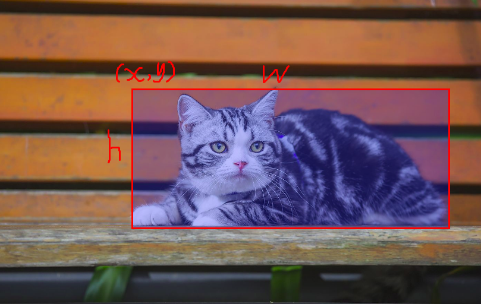
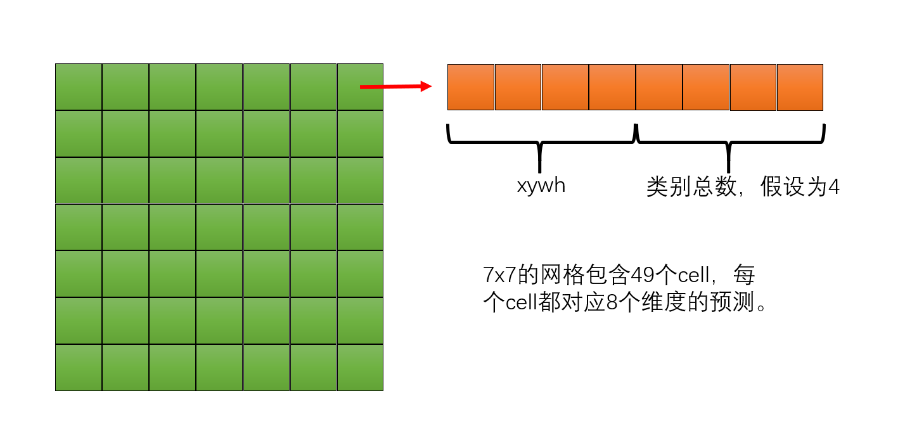
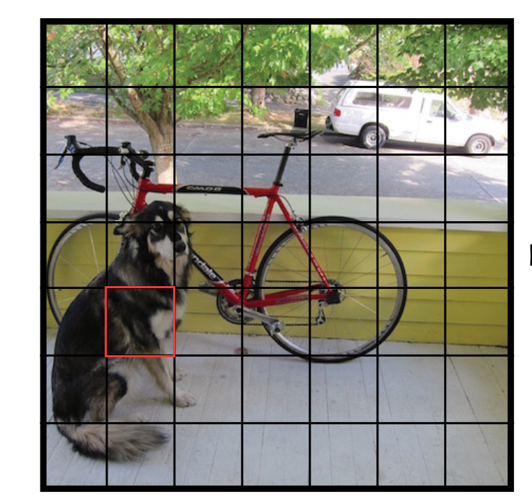
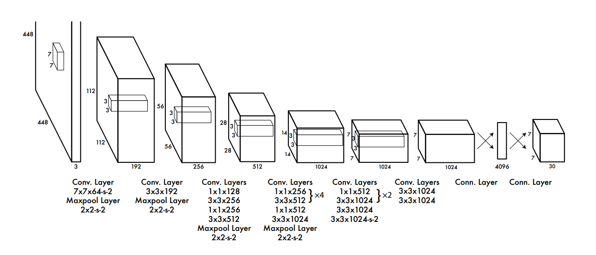
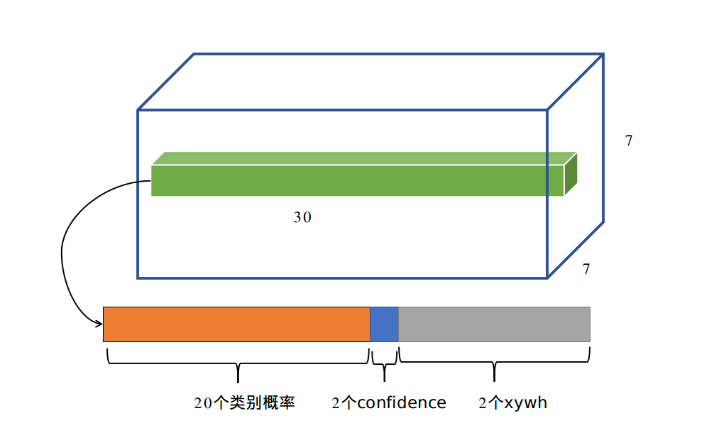
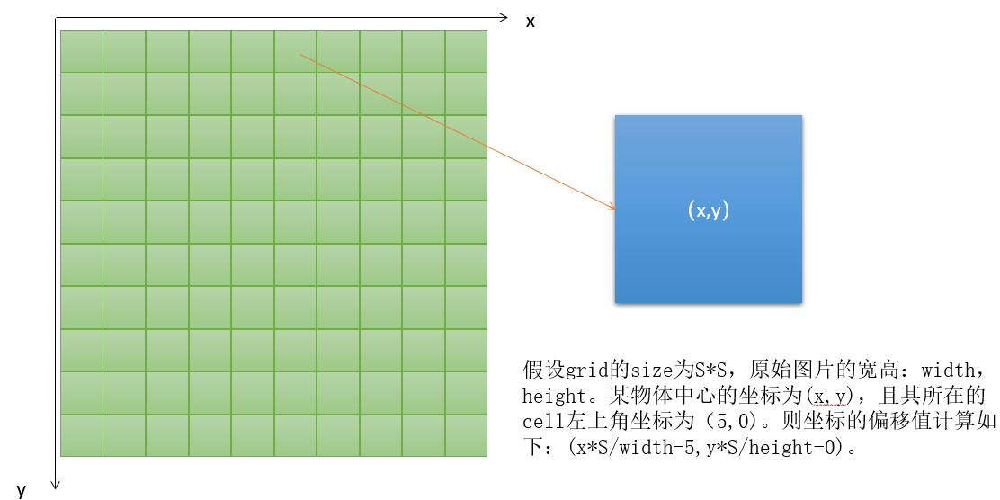

# 一文彻底读懂yolo

yolo v1(以下都称为yolo)算比较旧的算法了，不过近来想整理一下yolo系列算法，所以先从yolo开始整理。发现网上关于yolo的文章基本都是照着原文翻译，很多背后的原理没有讲清楚，所以本文尽量用最通俗易懂的语言来解释yolo。如果有理解不对的地方，欢迎指正。

## 一、yolo思想

yolo与其他算法的关系等废话不多说，直接开始讲yolo算法的思想。首先从最初的目标检测开始讲起。

### 1. 从目标检测讲起

首先假设深度学习还没用于目标检测，我们还不知道那么多目标检测算法。

我们先看一下目标检测要做什么事情。目标检测就是要找出图片中物体的bounding box（边界框），并判定框内物体的类别。比如上图中有一只猫，那我们要将这只猫用一个bounding box框出来(bounding box可以用左上角坐标(x,y)和矩形的宽高(w，h)来表示)。

对于这种任务我们要怎么做？一个很自然的想法就是，我把图片喂给深度网络，让网络学习吐出bounding box的xywh四个值以及图片的类别就好了。这么做貌似是可以的，但考虑这么一种情况：如果图片上除了一只猫之外还有一只狗，甚至更多的物体，我们都想把它们框出来，那么这时候网络就不仅仅要输出猫的预测，还有输出其他物体的预测。这个时候我们发现，网络的输出的维度是没办法固定的，图片中存在的物体越多，网络输出的维度就越大。所以这种思路行不通。

### 2. yolo的思想

既然网络的输出需要固定维度的，那么我们能不能设计一个固定维度大小的输出，并且输出的维度足够大，足以囊括图像中的所有物体呢？答案是可以的！yolo就是这么做的。yolo固定维度的办法是把网络的输出划分成网格形状，每个网格中的cell（格子）都可以输出物体的类别和bounding box的坐标，如下图所示（其实可以预测多个bounding box的类别和confidence，这里只讲思想，所以先忽略这个，后面会详细讲到）。

但问题的关键是，我们怎么知道网格内的cell需要预测图片中的哪个物体呢？这个其实取决于你怎么去设置网络的训练目标，说白一点就是，你要教它去预测哪个物体。具体来说，yolo是这么做的：

将输入图像按照网络的输出网格（比如7x7大小）进行划分，划分之后就有很多小cell（格子）了。我们再看图片中物体的中心是落在哪个cell里面，落在哪个cell哪个cell就负责预测这个物体。比如下图中，狗的中心落在了红色cell内，则这个cell负责预测狗。这么说可能不太容易理解，下面进行更具体的介绍。

实际上，“物体落在哪个cell，哪个cell就负责预测这个物体” 要分两个阶段来看，包括训练和测试。

1. 训练阶段。在训练阶段，如果物体中心落在这个cell，那么我就给模型输出的网格中对应的cell打上这个物体的label（包括xywh和类别），也就是说我们是通过这种方式来设置网络训练的label的。换言之，我们在训练阶段，就教会模型的输出网格中的cell要预测图像中的哪个物体。
2. 测试阶段。因为你在训练阶段已经教会了cell去预测中心落在该cell中的物体，那么cell自然也会这么做。

以上就是yolo最核心的思想。不过原文都是按照测试阶段来解说的，不容易让人理解。其实，知道训练阶段的意义更重要，因为训练阶段你告诉网络去预测什么，然后测试阶段才能按照你训练阶段教它的去做，如果你只知道测试阶段网络输出的意义，你就很可能会问：凭什么物体的中心落在这个cell它就负责预测这个物体？

## 二、模型

讲完了思想，我们来讲具体的流程。

### 1.模型架构

首先讲网络架构。网络架构没什么好讲的，直接看图就好了。

从图中可以看到，yolo网络的输出的网格是7x7大小的，另外，输出的channel数目为30。一个cell内，前20个元素是类别概率值，然后2个元素是边界框confidence，两者相乘可以得到类别confidence，最后8个元素是边界框的 $(x, y,w,h)$ 。

也就是说，每个cell有两个predictor，每个predictor分别预测一个bounding box的xywh和相应的confidence。但分类部分的预测却是共享的。基于这个，同个cell是没办法预测多个目标的。

现在考虑两个问题:

1. 假设类别预测不是共享的，cell中两个predictor都有各自的类别预测，这样能否在一个cell中预测两个目标？
2. 为什么要预测两个bounding box？

对于第一个问题，答案是否定的。如果一个cell要预测两个目标，那么这两个predictor要怎么分工预测这两个目标？谁负责谁？不知道，所以没办法预测。而像faster rcnn这类算法，可以根据anchor与ground truth的IOU大小来安排哪个anchor负责预测哪个物体，所以后来yolo2也采用了anchor思想，同个cell才能预测多个目标。

对于第二个问题，既然我们一个cell只能预测一个目标，为什么还要预测两个bounding box（或者更多）？这个还是要从训练阶段怎么给两个predictor安排训练目标来说。在训练的时候会在线地计算predictor预测的bounding box和ground truth的IOU，两个predictor中IOU大的那个，就会负责预测这个物体，另外一个则不预测。这么做有什么好处？我的理解是，这样做的话，实际上有两个predictor来一起进行预测，然后网络会在线选择预测得好的那个predictor（也就是IOU大）来进行预测。通俗一点说，就是我找一堆人来并行地干一件事，然后我选干的最好的那个。

### 2.模型输出的意义

**Confidence预测**

首先看cell预测的bounding box中condifence这个维度。confidence表示：cell预测的bounding box包含一个物体的置信度有多高并且该bounding box预测准确度有多大，用公式表示为：$Pr(Object) * IOU^{truth}_{pred}$。这个也要分两个阶段来考虑。

1. 对于训练阶段来说，我们要给每个bounding box的confidence打label，那么这个label怎么算? 其实很简单，如果一个物体中心没有落在cell之内，那么每个bounding box的$Pr(Object)=0$，IOU就没有算的必要了，因为$Pr(Object) * IOU^{truth}_{pred}$肯定等于0，因此confidence就直接设置为0。如果物体的中心落在了这个cell之内，这个时候$Pr(Object)=1$，因此confidence变成了$1*IOU^{truth}_{pred}$。注意这个IOU是在训练过程中不断计算出来的，网络在训练过程中预测的bounding box每次都不一样，所以和ground truth计算出来的IOU每次也会不一样。
2. 对于预测阶段，网络只输出一个confidence值，它实际上隐含地包含了$IOU^{truth}_{pred}$ 。

**Bounding box预测**

bounding box的预测包括xywh四个值。xy表示bounding box的中心相对于cell左上角坐标偏移，宽高则是相对于整张图片的。偏移的计算方法如下图所示。

xywh为什么要怎么这么表示呢？实际上经过这么表示之后，xywh都归一化了，它们的值都是在0-1之间。我们通常做回归问题的时候都会将输出进行归一化，否则可能导致各个输出维度的取值范围差别很大，进而导致训练的时候，网络更关注数值大的维度。因为数值大的维度，算loss相应会比较大，为了让这个loss减小，那么网络就会尽量学习让这个维度loss变小，最终导致区别对待。

**类别预测**

除此之外，还有一个物体类别，物体类别是一个条件概率$Pr(Class_i/Object)$。这个怎么理解？也可以分两个阶段来看。

1. 对于训练阶段，也就是打label阶段，我们给这个打上什么label呢？对于一个cell，如果物体的中心落在了这个cell，那么我们给它打上这个物体的类别label，并设置概率为1。换句话说，这个概率是存在一个条件的，这个条件就是必须存在物体。
2. 对于测试阶段来说，网络直接输出$p(class/object)$，就已经可以代表有物体存在的条件下类别概率。但是作者还把这个概率乘上了confidence。

论文中的公式是这样的：

也就是说我们预测的条件概率还要乘以confidence。为什么这么做呢？举个例子，对于某个cell来说，在预测阶段，即使这个cell不存在物体（即confidence的值为0），也存在一种可能：输出的条件概率$p(class/object)=0.9$，但将confidence和$p(class/object)$乘起来就变成0了。这个是很合理的，因为你得确保cell中有物体，你算类别概率才有意义。

## 三、训练

最后要讲的是训练阶段的loss。

需要计算loss的部分是：

1. 有物体中心落入的cell，需要计算分类loss，两个predictor都要计算confidence loss，预测的bounding box与ground truth IOU比较大的那个predictor需要计算xywh loss。
2. 没有物体中心落入的cell，只需要计算confidence loss。

另外，需要注意的是，每一项loss的计算都是L2 loss，即使是分类问题也是。所以说yolo是把分类问题转为了回归问题。

