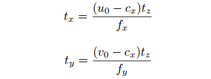
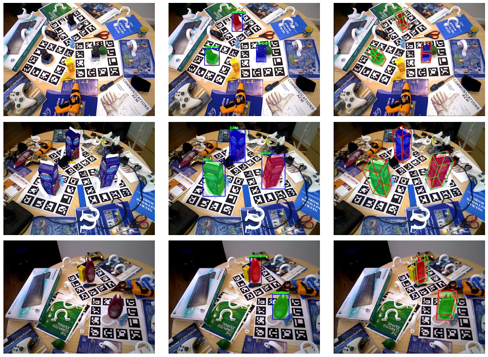
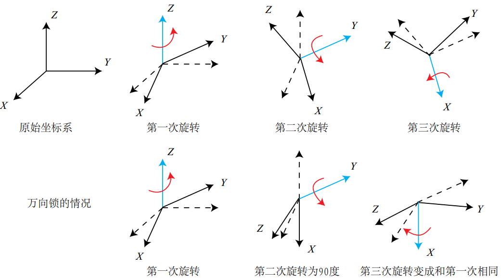
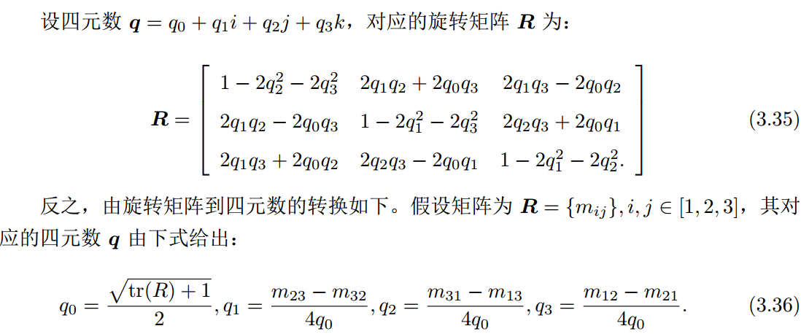
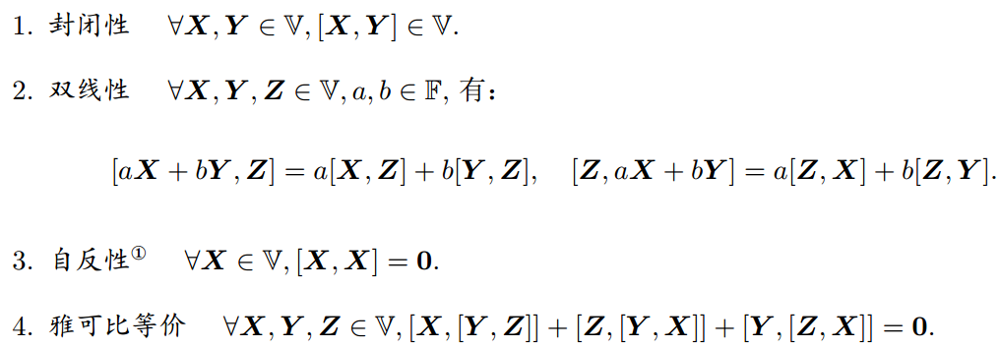
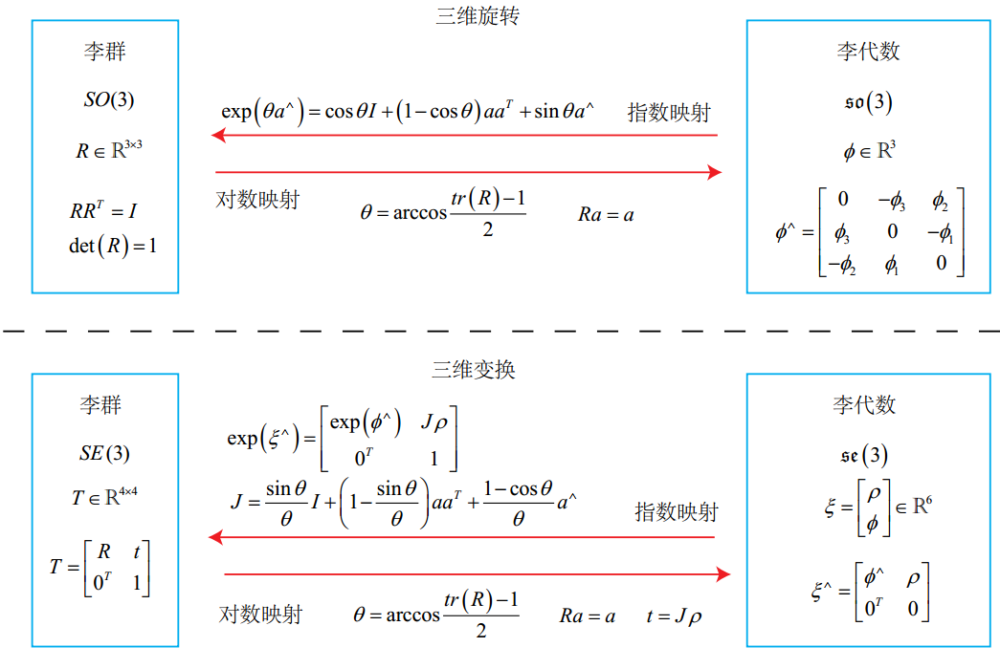

# Deep-6DPose

论文地址：https://arxiv.org/abs/1802.10367v1

## 1 创新点

​    (1) 提出一种仅基于rgb图片，能够端到端，无需pose refinement的、同时进行目标检测、实例分割和6d姿态估计的快速算法，前向帧率可达到10fps

​    (2) 基于优异的mask RCNN算法，新增一个6d姿态回归分支进行6d姿态估计，并提出一个简单的loss函数

​    (3) 6d姿态估计采用解耦回归方式，把3d旋转矩阵和3d平移向量解耦输出，同时为了保证可训练性，将3d旋转矩阵通过李代数Lie algebra转化表示

## 2 核心思想

​    本文算法思想非常简单。基于Mask RCNN算法，新增一个6d姿态分支，新增分支要考虑以下几个问题：

​    (1)  6d姿态包括3d旋转和3d平移，目前的做法都是解耦预测，作者也是采用解耦输出

​    (2) 3d旋转矩阵是一个特殊矩阵，如果直接进行回归，是无法训练的，需要进行转化，常用的转化方法有李代数so(3)，欧拉角和四元数，考虑复杂性，作者采用的是so(3)，转化为旋转向量

​    (3) 3d平移向量是一个3x1的向量，如果直接预测是可以的，但是实际上没有必要，因为我们在其他分支预测了2d边界框，通过2d边界框中心即可得到3d平移向量中的x,y，所以作者在3d平移向量中只预测输出z分量即可，加上旋转向量，6d姿态回归分支一共预测4个值即可

​    (4) 既然引入了新的分支，那么就需要定义loss，作者基于范数设计了一个非常简单的Loss

## 3 模型

### 3.1 网络结构

​    

​                                                                                      图 deep-6d模型图

由于网络结构和mask rcnn几乎不变，故不详述。

### 3.2 loss

$L_{cls}$分类损失函数是softmax loss，$L_{box}$边界框损失函数是smooth L1，$L_{mask}$掩码损失是二值交叉熵，$r$是回归的旋转向量，$\widehat{r}$是真实旋转向量，$t_z$是回归的平移向量z轴，$\widehat{t_z}$是真正的平移向量z轴，p是距离范数，$\beta$是平衡两者的权重。实际实验中作者设置的参数为：$\alpha _1,\alpha _2,\alpha _3,\alpha _4$为1,1,2,2,而$p=1，\beta =1.5$ 。

## 4 训练

​    训练参数设置为：sgd+0.9 momentum,0:0005 weight decay,Titan X GPU ,350k iterations,每个batch为1张图片，前150k代学习率是0.001，剩下的学习率为0.0001,RPN输出的RoIs固定为2000个。前向计算时候RPN输出固定为1000个。

​    在预测时候，输出4维表征旋转和平移的向量后，对前3个向量使用指数罗德里格映射算法得到3d旋转矩阵，同样，在训练时候使用罗德里格映射算法将3d旋转矩阵变为旋转向量即可。而第4个维度向量是平移向量的z轴，联合2d边界框的中心点坐标，可以很容易算出3d平移向量：

其中$u_0，v_0$是2d边界框的中心点坐标，$c_x,f_x,f_y$是相机内参。注意：上面原图的公式中$t_y$写错了，应该是$t_y=[(v_0-c_y)t_z]/f_y$.

​    作者所采用的训练数据集一共是2个：单目标数据集linemod和多目标数据集Tejani。在实际训练中有一个技巧：对于单目标数据集，假设每张图片中一共15个物体，但是每次我只标注其中一个物体进行训练，也就是说假设物体1在图片中，当前时刻物体1是前景，其他14个物体是背景，但是在下一次训练差不多类型的图片中，物体1是背景，其他某一个物体是前景，那么在分割中就会给网络带来混乱，也就是该物体一会说是背景，一会说是前景，导致的结果就是分割的结果不太好，且收敛速度慢。作者的解决办法是：使用当前最优秀的语义分割网络RefineNet作者预处理网络，具体操作是假设一共15个目标训练数据，对每个标注的单目标图片集训练一个RefineNet，训练好15个RefineNet后，拿出任意一个RefineNet，假设该网络是用于分割目标1，然后对RefineNet1输入其他目标的图片，如果该分割网络也输出部分掩码，那么就把对应掩码的像素直接过滤掉即可，所有的图片都处理一遍以及所有的RefineNet网络都过一遍，就可以去除以上问题。

## 5 结果

#### 5.1 评价指标计算

​    作者的评价指标和其他人的计算不太一样，所以需要特殊说明。

​    Detection指标：首先得到所有测试图片的真实bbox值，网络预测输出所有图片的预测bbox，当某一个预测的bbox值与真实bbox值的IOU大于某一定值时候，则预测正确bbox个数加1，最终的结果是预测正确的bbox个数除以真实bbox个数。IOU作者设置了两个取值，分别是0.5和0.9。对于Segmentation指标的计算也是一样的。

​     2D-pose 指标：首先得到所有测试图片的真实姿态值，包括旋转矩阵和旋转向量，网络预测输出所有图片的预测姿态，利用真实姿态和模型文件、相机内参可以绚烂出3d模型，然后得到2d图片，进而可得到物体掩码信息，最终得到bbox值，预测姿态也采用同样处理。然后当某一个预测的bbox值与真实bbox值的IOU大于0.5时候，则预测正确bbox个数加1，最终的结果是预测正确的bbox个数除以真实bbox个数。

​    5cm5◦指标：计算预测的平移向量与真实值在5cm范围内以及预测的角度与真实值在5°范围内的姿态个数占全部真实姿态的比重。

​    ADD 指标：average distance指标。计算真实姿态和预测姿态的变换模型点云数据直接的平均距离，然后当平均距离小于物体的直径的10%时候，就预测正确个数加1，最终的结果是预测正确的姿态个数除以真实姿态个数。

#### 5.2 预测结果

​    以下结果单位都是%。

 左1为原始rgb图片，中间为预测的2d边界框和mask，右1为估计的6d姿态(红色框为预测值，绿色框为真实值)

## 6 补充内容

### 6.1 三维刚体运动描述方式

​    本节考虑：一个刚体在三维空间中的运动是如何描述的？简单来说就是由一次旋转加一次平移组成，平移是比较简单的，无需多考虑，然而旋转就比较复杂了。三维刚体旋转运动的数学表示方式一共有4种方式：旋转矩阵，旋转向量，欧拉角和4元数。下面分开讲解。

#### 6.1.1 旋转矩阵

​    旋转矩阵R是一个3x3的矩阵，代表了相机的旋转。假设大家已经知道旋转矩阵的含义了，旋转矩阵有些特殊性质，事实上，它是一个行列式为 1 的正交矩阵。反之，行列式为 1 的正交矩阵也是一个旋转矩阵。所以，可以把旋转矩阵的集合定义如下：

$SO(n) $是特殊正交群（ Special Orthogonal Group）的意思，后面会详细讲解。这个集合由 n 维空间的旋转矩阵组成，特别的，$ SO(3) $就是三维空间的旋转了。通过旋转矩阵，我们可以直接谈论两个坐标系之间的旋转变换，而不用再从基开始谈
起。换句话说， **旋转矩阵可以描述相机的旋转**。

​    由于旋转矩阵为正交阵，它的逆（即转置）描述了一个相反的旋转。按照上面的定义方式，有：

显然 $R^T$ 刻画了一个相反的旋转。

#### 6.1.2 旋转向量

​    前面已知，可以用旋转矩阵来描述旋转，但是，矩阵表示方式至少有以下几个缺点：

​    (1) $SO(3)$ 的旋转矩阵有九个量，但一次旋转只有三个自由度。因此这种表达方式是冗余的

​    (2) 旋转矩阵自身带有约束：它必须是个正交矩阵，且行列式为 1。当我们想要估计或优化一个旋转矩阵时，这些约束会使得求解变得更困难。

​    因此，我们希望有一种方式能够紧凑地描述旋转和平移。例如，用一个三维向量表达旋转。实际上也是可行的。

​    对于坐标系的旋转，我们知道，**任意旋转都可以用一个旋转轴和一个旋转角来刻画**。于是，我们可以使用一个向量，其方向与旋转轴一致，而长度等于旋转角。这种向量，称为**旋转向量**（或轴角， AxisAngle）。这种表示法只需一个三维向量即可描述旋转。

​    假设有一个旋转轴为 $n$，角度为$ θ$的旋转，显然，它对应的旋转向量为$ θn$，由旋转向量到旋转矩阵的过程由罗德里格斯公式( Rodrigues’s Formula)计算，具体推导不讲：

符号 ^ 是向量到反对称的转换符，例如下式的$a$向量：

​    以上公式即可将旋转向量转化为旋转矩阵。

​    对于转角 $θ$，有：

​    可得：

以上公式即可将旋转矩阵转化为转角。对于转轴$n$，由于旋转轴上的向量在旋转后不发生改变，说明

因此，转轴$ n$ 是矩阵 $R $特征值 1 对应的特征向量。求解此方程，再归一化，就得到了旋转轴。通过以上两个公式即可将旋转矩阵转化为旋转向量。

#### 6.1.3 欧拉角

​    无论是旋转矩阵、旋转向量，虽然它们能描述旋转，但对我们人类是非常不直观的。当我们看到一个旋转矩阵或旋转向量时，采用欧拉角的方式是最直观的。欧拉角则提供了一种非常直观的方式来描述旋转——**它使用了三个分离的转角，把一个旋转分解成三次绕不同轴的旋转**。当然，由于分解方式有许多种，所以欧拉角也存在着不同的定义方法。比如说，当我先绕 X 轴旋转，再绕 Y 轴，最后绕 Z 轴，就得到了一个 XYZ 轴的旋转。同理，可以定义 ZYZ、 ZYX等等旋转方式。如果讨论更细一些，还需要区分每次旋转是绕固定轴旋转的，还是绕旋转之后的轴旋转的，这也会给出不一样的定义方式。欧拉角中比较常用的一种，便是用“偏航-俯仰-滚转”（ yaw-pitch-roll）三个角度来描述一个旋转的，它等价于 ZYX 轴的旋转。具体是：

​    (1) 绕物体的Z轴旋转，得到偏航角yaw；

​    (2) 绕**旋转之后**的Y轴旋转，得到俯仰角pitch；

​     (3) 绕**旋转之后**的X轴旋转，得到滚转角roll。

此时，我们可以使用$[r; p; y]^T$ 这样一个三维的向量描述任意旋转。这个向量十分的直观，我们可以从这个向量想象出旋转的过程。

​    欧拉角的一个重大缺点是会碰到著名的**万向锁问题**（ Gimbal Lock）：在俯仰角为±90◦ 时，第一次旋转与第三次旋转将使用同一个轴，使得系统丢失了一个自由度（由三次旋转变成了两次旋转）。这被称为奇异性问题，在其他形式的欧拉角中也同样存在。**理论上可以证明，只要我们想用三个实数来表达三维旋转时，都会不可避免地碰到奇异性问题,包括旋转向量**。

#### 6.1.4 四元数

​    旋转矩阵用九个量描述三自由度的旋转，具有冗余性；欧拉角和旋转向量是紧凑的，但具有奇异性。而四元数表示法则不存在上述问题。

​    回忆我们以前学习过的复数。我们用复数集 C 表示复平面上的向量，而复数的乘法则能表示复平面上的旋转：例如，乘上复数$ i$ 相当于逆时针把一个复向量旋转 90 度。类似的，在表达三维空间旋转时，也有一种类似于复数的代数： 四元数（ Quaternion）。四元数既是紧凑的，也没有奇异性。

​    一个四元数 $q$ 拥有一个实部和三个虚部:

​    考虑到三维空间需要三个轴，四元数也有三个虚部，那么一个虚四元数(实部为0)对应到一个空间点。我们知道一个模
长为 1 的复数，可以表示复平面上的纯旋转（没有长度的缩放），那么我们用**单位四元数**表示三维空间中任意一个旋转，假设某个旋转是绕单位向量$ n = [nx; ny; nz]^T$进行了角度为$ θ $的旋转，那么这个旋转的四元数形式为：

反之，我们亦可从单位四元数中计算出对应旋转轴与夹角：

通过以上公式，可以对旋转矩阵、旋转向量和四元数进行相互转换。上述公式描述的是四元数转换为旋转向量，然后再转换为旋转矩阵，但是实际上可以直接将四元数和旋转矩阵进行转换：

**无论是四元数、旋转矩阵还是轴角，它们都可以用来描述同一个旋转。我们应该在实际中选择对我们最为方便的形式，而不必拘泥于某种特定的样子**。

### 6.2 李群和李代数

​        李群和李代数在SLAM中是一个非常重要的数学基础，但是对于基于深度学习的6d姿态估计问题来说，不是很重要，但是其有助于理解旋转矩阵和旋转向量的一些性质，旋转矩阵和旋转向量的相互转化也会用于这部分数学原理。但是如果不关心的读者，只需要了解6.1节部分就可以，6.2部分可不看。

​    其实**旋转矩阵构成了一个特殊正交群SO(3)，而变换矩阵T构成了特殊欧氏群$ SE(3)$**。

注意：旋转矩阵也好，变换矩阵也好， 它们对加法是不封闭的。换句话说，对于任意两个旋转矩阵 R1; R2，它们按照矩阵加法的定义，和不再是一个旋转矩阵。

#### 4.2.1 群定义

​    **群（ Group）是一种集合加上一种运算的代数结构**。我们把集合记作 A，运算记作 ·，那么群可以记作$ G = (A; ·)$。群要求这个运算满足以下几个条件：

我们可以验证，旋转矩阵集合和矩阵乘法构成群。很容易可知，旋转矩阵是特殊正交群SO(3)。

​    群结构保证了在群上的运算具有良好的性质。**李群**是指具有连续（光滑）性质的群。像整数群$ Z $那样离散的群没有连续性质，所以不是李群。而 $SO(n) 和 SE(n)$，它们在实数空间上是连续的。我们能够直观地想象一个刚体能够连续地在空间中运动，所以它们都是李群。相机运动仅仅关心两种李群$SO(3)、SE(3)$和对应的两种李代数$so(3)、se(3)$。

#### 4.2.2 李代数定义

​    **每个李群都有与之对应的李代数**。李代数描述了李群的局部性质。通用的李代数的定义如下：李代数由一个集合 V，一个数域 F 和一个二元运算 [;] 组成。如果它们满足以下几条性质，称 (V; F;[;]) 为一个李代数，记作 g。

其中二元运算被称为**李括号**。看起来蛮复杂的。但是其实转化到具体的三维空间来看，就非常简单了。三维向量 $R^3 $上定义的叉积 × 是一种李括号，因为在三维空间中的2个向量叉乘，得到的新向量是垂直于这两个向量所构成的平面的，因此$ g = (R^3; R; ×) $构成了一个李代数。

#### 4.2.3 李代数$so(3)$

​      考虑任意旋转矩阵 R，我们知道它满足：  

现在，我们说，$ R $是某个相机的旋转，它会随时间连续地变化，即为时间的函数： $R(t)$。由于它仍是旋转矩阵，有

在等式两边对时间求导，得到：

整理得：

可以看出 $\dot {R}(t)R(t)^T $是一个反对称矩阵。联系前面将的知识点，通过引入了 ^ 符号，将一个向量变成了反对称矩阵，同理，对于任意反对称矩阵，我们亦能找到一个与之对应的向量，把这个运算用符号$\vee$ 表示

因此我们可以找到一个三维向量$ ϕ(t) \in  R^3$ 与之对应。于是有：

等式两边右乘 $R(t)$，由于 R 为正交阵，有：

可以看到，每对旋转矩阵求一次导数，只需左乘一个 $ϕ(t) ^\wedge $矩阵即可。为方便讨论，我们设 $t_0 = 0$，并设此时旋转矩阵为 $R(0) = I$。按照导数定义，可以把$ R(t) $在 0 附近进行一阶泰勒展开：

同时在$ t_0 $附近，设 $ϕ $保持为常数 $ϕ(t_0) = ϕ_0$，由$R(t)$的导数式子(上上个公式)：

上式是一个关于 $R$ 的微分方程，而且我们知道初始值 $R(0) = I$，解之，得：

最终得到上述公式，**注意上述公式是我们真正关心的，非常重要**。我们看到，旋转矩阵$ R $与另一个反对称矩阵 $ϕ_0 $通过指数关系发生了联系。也就是说，当我们知道某个时刻的 $R $时，存在一个向量$ ϕ$，它们满足这个矩阵指数关系。**其实上述公式就是旋转矩阵和旋转向量转化的罗德里格旋转公式(6.1节我们是直接用了而已)，而指数矩阵正是李群与李代数间的指数/对数映射。**

​    也就是说$ϕ$，事实上是一种李代数。 $SO(3) $对应的李代数是定义在 $R^3$上的向量，我们记作 $ϕ$。根据前面的推导，每个 $ϕ $都可以生成一个反对称矩阵， 即$so(3)$ 的元素是 3 维向量或者 3 维反对称矩阵:

​    至此，我们已清楚了$ so(3)$ 的内容。它们是一个由三维向量组成的集合，每个向量对应到一个反对称矩阵，可以表达旋转矩阵的导数。它与$ SO(3) $的关系由指数映射给定。

#### 4.2.4 指数与对数映射

​    由于这部分推导对我们算法没有啥帮助，这里就不写了，只讲结论：$SO(3) $上的指数映射即为李代数$so(3)$，也可以推导出罗德里格旋转公式。这表明， $so(3) $实际上就是由所谓的**旋转向量**组成的空间，而**指数映射即罗德里格斯公式**。通过它们，我们把$so(3) $中任意一个向量对应到了一个位于 $SO(3)$ 中的旋转矩阵。反之，如果定义对数映射，我们也能把$ SO(3)$ 中的元素对应到$ so(3) $中，这正好就是旋转向量和旋转矩阵的相互转化。

​    需要注意的是：**指数映射只是一个满射**。这意味着每个$SO(3) $中的元素，都可以找到一个 $so(3)$ 元素与之对应；但是可能存在多个$so(3) $中的元素，对应到同一个$ SO(3)$。至少对于旋转角$ θ$，我们知道多转 360 度和没有转是一样的——它具有周期性。但是，如果我们把旋转角度固定在$ ±π $之间，那么李群和李代数元素是一一对应的。

