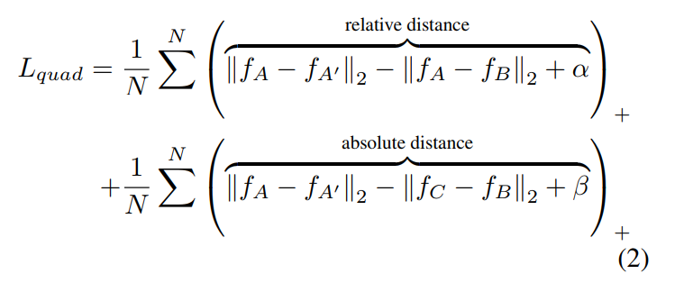
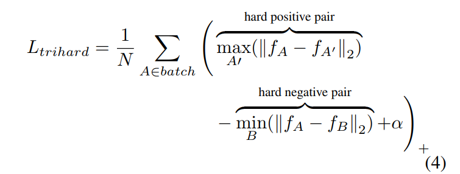
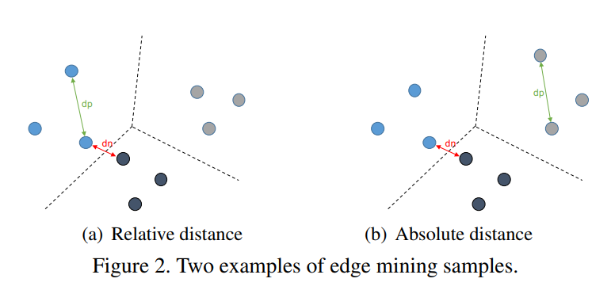
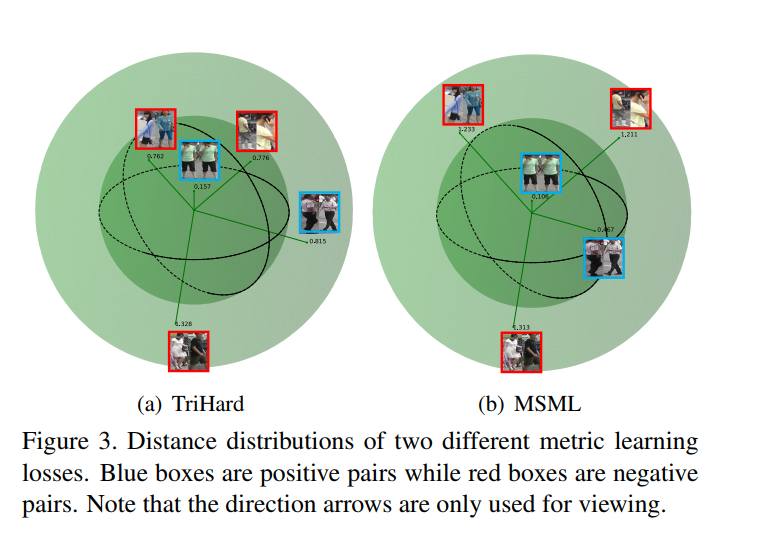

# Person re-id

## 一、综述

### 1. 什么是行人重识别

行人重识别（Person Re-identification）也称行人再识别，本文简称为ReID，是利用计算机视觉技术判断图像或者视频序列中是否存在特定行人的技术。广泛被认为是一个图像检索的子问题。给定一个监控行人图像，检索跨设备下的该行人图像。

在监控视频中，由于相机分辨率和拍摄角度的缘故，通常无法得到质量非常高的人脸图片。当人脸识别失效的情况下，ReID就成为了一个非常重要的替代品技术。ReID有一个非常重要的特性就是跨摄像头，所以学术论文里评价性能的时候，是要检索出不同摄像头下的相同行人图片。ReID已经在学术界研究多年，但直到最近几年随着深度学习的发展，才取得了非常巨大的突破。

### 2. 几个问题

1. 能不能用人脸识别做重识别？

   理论上是可以的。但是有两个原因导致人脸识别较难应用：首先，广泛存在后脑勺和侧脸的情况，做正脸的人脸识别难。其次，摄像头拍摄的像素可能不高，尤其是远景摄像头里面人脸截出来很可能都没有32x32的像素。所以人脸识别在实际的重识别应用中很可能有限。

2. 有些人靠衣服的颜色就可以判断出来了，还需要行人重识别么？

   衣服颜色确实是行人重识别 做出判断一个重要因素，但光靠颜色是不足的。首先，摄像头之间是有色差，并且会有光照的影响。其次，有撞衫（颜色相似）的人怎么办，要找细节，但比如颜色直方图这种统计的特征就把细节给忽略了。在多个数据集上的测试表明，光用颜色特征是难以达到50%的top1正确率的。

3. 使用图像检索的指标来衡量行人重识别的结果是否合适？

   在早期，行人重识别数据集是由两个摄像头采集的比如viper，每个query只有一个正确的retrieval目标。所以往往使用top1比较。但在近期，随着大数据集的提出，数据集中往往包含多个摄像头的多个正确目标。光使用top1的话，不能反应模型的真实能力。所以类似图像检索，重识别加入了mAP作为衡量标准，将top2,top3...topn都考虑进去。

4. 测试方式

   主要有两种方案：a.测试的输入是一对行人，输出为这对行人的相似度，然后再按相似度排序；b.输入单个人，提取特征，再计算与其他人的欧式距离，然后再按距离排序。

   第一种方案的优点是，判断两个人是不是一个人，简单的二分类（是／否）。但缺点是如果我们搜索库中有m张图片，那么与目标图片组成m对图片对。每一对都要进一次模型，估算相似度，这极大的增加了测试的时间。如果我们有n个query，那么我们要计算nm次相似度（而m往往很大）。另一种方案是，预先提取行人的特征，我们只要预先提好n+m次特征。之后只要比较就好了，比较特征可以简单的用矩阵乘法实现。

目前两种方案都有在用，但是后一种更接近实际中图像搜索的要求，用特征来快速检索。

### 3. 主要方法

本文介绍一些近几年基于深度学习的ReID工作，由于精力有限并不能涵盖所有工作，只能介绍几篇代表性的工作。按照个人的习惯，我把这些方法分为以下几类：

1. 基于表征学习的ReID方法
2. 基于度量学习的ReID方法
3. 基于局部特征的ReID方法
4. 基于视频序列的ReID方法
5. 基于GAN造图的ReID方法

#### 1、基于表征学习的ReID方法

基于表征学习(Representation learning)的方法是一类非常常用的行人重识别方法[1-4]。这主要得益于深度学习，尤其是卷积神经网络(Convolutional neural network, CNN)的快速发展。由于CNN可以自动从原始的图像数据中根据任务需求自动提取出表征特征(Representation)，所以有些研究者把行人重识别问题看做分类(Classification/Identification)问题或者验证(Verification)问题：（1）**分类问题**是指利用行人的ID或者属性等作为训练标签来训练模型；（2）**验证问题**是指输入一对（两张）行人图片，让网络来学习这两张图片是否属于同一个行人。

论文[1]利用Classification/Identification loss和verification loss来训练网络，其网络示意图如下图所示。网络输入为若干对行人图片，包括分类子网络(Classification Subnet)和验证子网络(Verification Subnet)。分类子网络对图片进行ID预测，根据预测的ID来计算分类误差损失。验证子网络融合两张图片的特征，判断这两张图片是否属于同一个行人，该子网络实质上等于一个二分类网络。经过足够数据的训练，再次输入一张测试图片，网络将自动提取出一个特征，这个特征用于行人重识别任务。

> 问题：
>
> 1. 分类问题怎么做的？有非常多的人，每个人都当作一类？
> 2. 行人的ID和属性怎么作为训练标签。
> 3. 学习的特征怎么使用？

但是也有论文认为光靠行人的ID信息不足以学习出一个泛化能力足够强的模型。在这些工作中，它们额外标注了行人图片的属性特征，例如性别、头发、衣着等属性。通过引入行人属性标签，模型不但要准确地预测出行人ID，还要预测出各项正确的行人属性，这大大增加了模型的泛化能力，多数论文也显示这种方法是有效的。下图是其中一个示例[2]，从图中可以看出，网络输出的特征不仅用于预测行人的ID信息，还用于预测各项行人属性。通过结合ID损失和属性损失能够提高网络的泛化能力。

如今依然有大量工作是基于表征学习，表征学习也成为了ReID领域的一个非常重要的baseline，并且表征学习的方法比较鲁棒，训练比较稳定，结果也比较容易复现。但是个人的实际经验感觉表征学习容易在数据集的domain上过拟合，并且当训练ID增加到一定程度的时候会显得比较乏力。

#### 2、基于度量学习的ReID方法

度量学习(Metric learning)是广泛用于图像检索领域的一种方法。不同于表征学习，度量学习旨在通过网络学习出两张图片的相似度。在行人重识别问题上，具体为同一行人的不同图片相似度大于不同行人的不同图片。最后网络的损失函数使得相同行人图片（正样本对）的距离尽可能小，不同行人图片（负样本对）的距离尽可能大。常用的度量学习损失方法有对比损失(Contrastive loss)[5]、三元组损失(Triplet loss)[6-8]、 四元组损失(Quadruplet loss)[9]、难样本采样三元组损失(Triplet hard loss with batch hard mining, TriHard loss)[10]、边界挖掘损失(Margin sample mining loss, MSML)[11]。首先，假如有两张输入图片  和  ，通过网络的前馈我们可以得到它们归一化后的特征向量  和  。我们定义这两张图片特征向量的欧式距离为：

**（1）对比损失(Contrastive loss)**

对比损失用于训练孪生网络(Siamese network)，其结构图如上图所示。孪生网络的输入为一对（两张）图片  和  ，这两张图片可以为同一行人，也可以为不同行人。每一对训练图片都有一个标签  ，其中  表示两张图片属于同一个行人（正样本对），反之  表示它们属于不同行人（负样本对）。之后，对比损失函数写作:

其中  表示  ，  是根据实际需求设计的阈值参数。为了最小化损失函数，当网络输入一对正样本对，  会逐渐变小，即相同ID的行人图片会逐渐在特征空间形成聚类。反之，当网络输入一对负样本对时，  会逐渐变大直到超过设定的  。通过最小化  ，最后可以使得正样本对之间的距离逐渐变小，负样本对之间的距离逐渐变大，从而满足行人重识别任务的需要。

**（2）三元组损失(Triplet loss)**

三元组损失是一种被广泛应用的度量学习损失，之后的大量度量学习方法也是基于三元组损失演变而来。顾名思义，三元组损失需要三张输入图片。和对比损失不同，一个输入的三元组（Triplet）包括一对正样本对和一对负样本对。三张图片分别命名为固定图片(Anchor)  ，正样本图片(Positive)  和负样本图片(Negative)  。图片  和图片  为一对正样本对，图片  和图片 为一对负样本对。则三元组损失表示为：

如下图所示，三元组可以拉近正样本对之间的距离，推开负样本对之间的距离，最后使得相同ID的行人图片在特征空间里形成聚类，达到行人重识别的目的。

论文[8]认为原版的Triplet loss只考虑正负样本对之间的相对距离，而并没有考虑正样本对之间的绝对距离，为此提出改进三元组损失(Improved triplet loss)：

公式添加  项，保证网络不仅能够在特征空间把正负样本推开，也能保证正样本对之间的距离很近。

> 若是没改进：只要正样本与anchor的距离大于负样本与anchor的距离就可以了。
>
> 改进之后：正样本与anchor的距离大于负样本与anchor的距离，同时正样本之间的距离也要足够小。

**（3） 四元组损失(Quadruplet loss)**

四元组损失是三元组损失的另一个改进版本。顾名思义，四元组(Quadruplet)需要四张输入图片，和三元组不同的是多了一张负样本图片。即四张图片为固定图片(Anchor)  ，正样本图片(Positive)  ,负样本图片1(Negative1)  和负样本图片2(Negative2)  。其中  和  是两张不同行人ID的图片，其结构如上图所示。则四元组损失表示为：

其中  和  是手动设置的正常数，通常设置  小于  ，前一项称为强推动，后一项称为弱推动。相比于三元组损失只考虑正负样本间的相对距离，**四元组添加的第二项不共享ID，所以考虑的是正负样本间的绝对距离。**因此，四元组损失通常能让模型学习到更好的表征。

> 四元组添加的第二项不共享ID，所以考虑的是正负样本间的绝对距离。
>
> 这句话怎么理解？为什么要让n1和n2的距离拉大？为什么是考虑正负样本之间的绝对距离？

**（4）难样本采样三元组损失(Triplet loss with batch hard mining, TriHard loss)**

难样采样三元组损失（本文之后用TriHard损失表示）是三元组损失的改进版。传统的三元组随机从训练数据中抽样三张图片，这样的做法虽然比较简单，但是抽样出来的大部分都是简单易区分的样本对。如果大量训练的样本对都是简单的样本对，那么这是不利于网络学习到更好的表征。大量论文发现用更难的样本去训练网络能够提高网络的泛化能力，而采样难样本对的方法很多。论文[10]提出了一种基于训练批量(Batch)的在线难样本采样方法——TriHard Loss。

TriHard损失的核心思想是：对于每一个训练batch，随机挑选  个ID的行人，每个行人随机挑选  张不同的图片，即一个batch含有  张图片。之后对于batch中的每一张图片  ，我们可以挑选一个最难的正样本和一个最难的负样本和  组成一个三元组。

首先我们定义和  为相同ID的图片集为  ，剩下不同ID的图片图片集为  ，则TriHard损失表示为：

其中  是人为设定的阈值参数。TriHard损失会计算  和batch中的每一张图片在特征空间的欧式距离，然后选出与  距离最远（最不像）的正样本  和距离最近（最像）的负样本  来计算三元组损失。通常TriHard损失效果比传统的三元组损失要好。

**（5）边界挖掘损失(Margin sample mining loss, MSML)**

边界样本挖掘损失(MSML)是一种引入难样本采样思想的度量学习方法。三元组损失只考虑了正负样本对之间的相对距离。为了引入正负样本对之间的绝对距离，四元组损失加入一张负样本组成了四元组。四元组损失也定义为：

假如我们忽视参数  和  的影响，我们可以用一种更加通用的形式表示四元组损失:

其中  和  是一对负样本对，  和  既可以是一对正样本对也可以是一对负样本对。之后把TriHard loss的难样本挖掘思想引入进来，便可以得到：

其中  均是batch中的图片，  是batch中最不像的正样本对，  是batch 中最像的负样本对，  皆可以是正样本对也可以是负样本对。概括而言TriHard损失是针对batch中的每一张图片都挑选了一个三元组，而MSML损失只挑选出最难的一个正样本对和最难的一个负样本对计算损失。所以MSML是比TriHard更难的一种难样本采样，此外  可以看作是正样本对距离的上界，  可以看作是负样本对的下界。MSML是为了把正负样本对的边界给推开，因此命名为边界样本挖掘损失。总的概括，MSML是同时兼顾相对距离和绝对距离并引入了难样本采样思想的度量学习方法。其演变思想如下图：

**（6）各种loss的性能对比**

在论文[11]之中，对上面提到的主要损失函数在尽可能公平的实验的条件下进行性能对比，实验结果如下表所示。作为一个参考

 

#### 3、基于局部特征的ReID方法

早期的ReID研究大家还主要关注点在全局的global feature上，就是用整图得到一个特征向量进行图像检索。但是后来大家逐渐发现全局特征遇到了瓶颈，于是开始渐渐研究起局部的local feature。常用的提取局部特征的思路主要有图像切块、利用骨架关键点定位以及姿态矫正等等。

（1）图片切块是一种很常见的提取局部特征方式[12]。如下图所示，图片被垂直等分为若干份，因为垂直切割更符合我们对人体识别的直观感受，所以行人重识别领域很少用到水平切割。

之后，被分割好的若干块图像块按照顺序送到一个长短时记忆网络(Long short term memory network, LSTM)，最后的特征融合了所有图像块的局部特征。但是这种缺点在于对图像对齐的要求比较高，如果两幅图像没有上下对齐，那么很可能出现头和上身对比的现象，反而使得模型判断错误。

（2）为了解决图像不对齐情况下手动图像切片失效的问题，一些论文利用一些先验知识先将行人进行对齐，这些先验知识主要是预训练的人体姿态(Pose)和骨架关键点(Skeleton) 模型。论文[13]先用姿态估计的模型估计出行人的关键点，然后用仿射变换使得相同的关键点对齐。如下图所示，一个行人通常被分为14个关键点，这14个关键点把人体结果分为若干个区域。为了提取不同尺度上的局部特征，作者设定了三个不同的PoseBox组合。之后这三个PoseBox矫正后的图片和原始为矫正的图片一起送到网络里去提取特征，这个特征包含了全局信息和局部信息。特别提出，这个仿射变换可以在进入网络之前的预处理中进行，也可以在输入到网络后进行。如果是后者的话需要需要对仿射变换做一个改进，因为传统的仿射变化是不可导的。为了使得网络可以训练，需要引入可导的近似放射变化，在本文中不赘述相关知识。

（3）CVPR2017的工作Spindle Net[14]也利用了14个人体关键点来提取局部特征。和论文[12]不同的是，Spindle Net并没有用仿射变换来对齐局部图像区域，而是直接利用这些关键点来抠出感兴趣区域(Region of interest, ROI)。Spindle Net网络如下图所示，首先通过骨架关键点提取的网络提取14个人体关键点，之后利用这些关键点提取7个人体结构ROI。网络中所有提取特征的CNN（橙色表示）参数都是共享的，这个CNN分成了线性的三个子网络FEN-C1、FEN-C2、FEN-C3。对于输入的一张行人图片，有一个预训练好的骨架关键点提取CNN（蓝色表示）来获得14个人体关键点，从而得到7个ROI区域，其中包括三个大区域（头、上身、下身）和四个四肢小区域。这7个ROI区域和原始图片进入同一个CNN网络提取特征。原始图片经过完整的CNN得到一个全局特征。三个大区域经过FEN-C2和FEN-C3子网络得到三个局部特征。四个四肢区域经过FEN-C3子网络得到四个局部特征。之后这8个特征按照图示的方式在不同的尺度进行联结，最终得到一个融合全局特征和多个尺度局部特征的行人重识别特征。

（4）论文[15]提出了一种全局-局部对齐特征描述子(Global-Local-Alignment Descriptor, GLAD)，来解决行人姿态变化的问题。与Spindle Net类似，GLAD利用提取的人体关键点把图片分为头部、上身和下身三个部分。之后将整图和三个局部图片一起输入到一个参数共享CNN网络中，最后提取的特征融合了全局和局部的特征。为了适应不同分辨率大小的图片输入，网络利用全局平均池化(Global average pooling, GAP)来提取各自的特征。和Spindle Net略微不同的是四个输入图片各自计算对应的损失，而不是融合为一个特征计算一个总的损失。

（5）以上所有的局部特征对齐方法都需要一个额外的骨架关键点或者姿态估计的模型。而训练一个可以达到实用程度的模型需要收集足够多的训练数据，这个代价是非常大的。为了解决以上问题，AlignedReID[16]提出基于SP距离的自动对齐模型，在不需要额外信息的情况下来自动对齐局部特征。而采用的方法就是动态对齐算法，或者也叫最短路径距离。这个最短距离就是自动计算出的local distance。

这个local distance可以和任何global distance的方法结合起来，论文[15]选择以TriHard loss作为baseline实验，最后整个网络的结构如下图所示，具体细节可以去看原论文。

#### 4、基于视频序列的ReID方法

目前单帧的ReID研究还是主流，因为相对来说数据集比较小，哪怕一个单GPU的PC做一次实验也不会花太长时间。但是通常单帧图像的信息是有限的，因此有很多工作集中在利用视频序列来进行行人重识别方法的研究[17-24]。基于视频序列的方法最主要的不同点就是这类方法不仅考虑了图像的内容信息，还考虑了帧与帧之间的运动信息等。

基于单帧图像的方法主要思想是利用CNN来提取图像的空间特征，而基于视频序列的方法主要思想是利用CNN 来提取空间特征的同时利用递归循环网络(Recurrent neural networks, RNN)来提取时序特征。上图是非常典型的思路，网络输入为图像序列。每张图像都经过一个共享的CNN提取出图像空间内容特征，之后这些特征向量被输入到一个RNN网络去提取最终的特征。最终的特征融合了单帧图像的内容特征和帧与帧之间的运动特征。而这个特征用于代替前面单帧方法的图像特征来训练网络。

视频序列类的代表方法之一是累计运动背景网络(Accumulative motion context network, AMOC)[23]。AMOC输入的包括原始的图像序列和提取的光流序列。通常提取光流信息需要用到传统的光流提取算法，但是这些算法计算耗时，并且无法与深度学习网络兼容。为了能够得到一个自动提取光流的网络，作者首先训练了一个运动信息网络(Motion network, Moti Nets)。这个运动网络输入为原始的图像序列，标签为传统方法提取的光流序列。如下图所示，原始的图像序列显示在第一排，提取的光流序列显示在第二排。网络有三个光流预测的输出，分别为Pred1，Pred2，Pred3，这三个输出能够预测三个不同尺度的光流图。最后网络融合了三个尺度上的光流预测输出来得到最终光流图，预测的光流序列在第三排显示。通过最小化预测光流图和提取光流图的误差，网络能够提取出较准确的运动特征。

AMOC的核心思想在于网络除了要提取序列图像的特征，还要提取运动光流的运动特征，其网络结构图如下图所示。AMOC拥有空间信息网络(Spatial network, Spat Nets)和运动信息网络两个子网络。图像序列的每一帧图像都被输入到Spat Nets来提取图像的全局内容特征。而相邻的两帧将会送到Moti Nets来提取光流图特征。之后空间特征和光流特征融合后输入到一个RNN来提取时序特征。通过AMOC网络，每个图像序列都能被提取出一个融合了内容信息、运动信息的特征。网络采用了分类损失和对比损失来训练模型。融合了运动信息的序列图像特征能够提高行人重识别的准确度。

论文[24]从另外一个角度展示了多帧序列弥补单帧信息不足的作用，目前大部分video based ReID方法还是不管三七二十一的把序列信息输给网络，让网络去自己学有用的信息，并没有直观的去解释为什么多帧信息有用。而论文[24]则很明确地指出当单帧图像遇到遮挡等情况的时候，可以用多帧的其他信息来弥补，直接诱导网络去对图片进行一个质量判断，降低质量差的帧的重要度。

如上图，文章认为在遮挡较严重的情况下，如果用一般的pooling会造成attention map变差，遮挡区域的特征会丢失很多。而利用论文的方法每帧进行一个质量判断，就可以着重考虑那些比较完整的几帧，使得attention map比较完整。而关键的实现就是利用一个pose estimation的网络，论文叫做landmark detector。当landmark不完整的时候就证明存在遮挡，则图片质量就会变差。之后pose feature map和global feature map都同时输入到网络，让网络对每帧进行一个权重判断，给高质量帧打上高权重，然后对feature map进行一个线性叠加。思路比较简单但是还是比较让人信服的。

 

#### 5、基于GAN造图的ReID方法

ReID有一个非常大的问题就是数据获取困难，截止CVPR18 deadline截稿之前，最大的ReID数据集也就小几千个ID，几万张图片（序列假定只算一张）。因此在ICCV17 GAN造图做ReID挖了第一个坑之后，就有大量GAN的工作涌现，尤其是在CVPR18 deadline截稿之后arxiv出现了好几篇很好的paper。

论文[25]是第一篇用GAN做ReID的文章，发表在ICCV17会议，虽然论文比较简单，但是作为挖坑鼻祖引出一系列很好的工作。如下图，这篇论文生成的图像质量还不是很高，甚至可以用很惨来形容。另外一个问题就是由于图像是随机生成的，也就是说是没有可以标注label可以用。为了解决这个问题，论文提出一个标签平滑的方法。实际操作也很简单，就是把label vector每一个元素的值都取一样，满足加起来为1。反正也看不出属于哪个人，那就一碗水端平。生成的图像作为训练数据加入到训练之中，由于当时的baseline还不像现在这么高，所以效果还挺明显的，至少数据量多了过拟合能避免很多。

论文[26]是上一篇论文的加强版，来自同一个课题组。前一篇的GAN造图还是随机的，在这一篇中变成了可以控制的生成图。ReID有个问题就是不同的摄像头存在着bias，这个bias可能来自光线、角度等各个因素。为了克服这个问题，论文使用GAN将一个摄像头的图片transfer到另外一个摄像头。在GAN方面依然还是比较正常的应用，和前作不同的是这篇论文生成的图是可以控制，也就是说ID是明确的。于是标签平滑也做了改进，公式如下：

其中  是ID的数量。  是手动设置的平滑参数，当  时就是正常的one-hot向量，不过由于是造的图，所以希望label不要这么hard，因此加入了一个平滑参数，实验表明这样做效果不错。最终整体的网络框架如下图：

除了摄像头的bias，ReID还有个问题就是数据集存在bias，这个bias很大一部分原因就是环境造成的。为了克服这个bias，论文[27]使用GAN把一个数据集的行人迁移到另外一个数据集。为了实现这个迁移，GAN的loss稍微设计了一下，一个是前景的绝对误差loss，一个是正常的判别器loss。判别器loss是用来判断生成的图属于哪个域，前景的loss是为了保证行人前景尽可能逼真不变。这个前景mask使用PSPnet来得到的，效果如下图。论文的另外一个贡献就是提出了一个MSMT17数据集，是个挺大的数据集，希望能够早日public出来。

ReID的其中一个难点就是姿态的不同，为了克服这个问题论文[28]使用GAN造出了一系列标准的姿态图片。论文总共提取了8个pose，这个8个pose基本涵盖了各个角度。每一张图片都生成这样标准的8个pose，那么pose不同的问题就解决。最终用这些图片的feature进行一个average pooling得到最终的feature，这个feature融合了各个pose的信息，很好地解决的pose bias问题。无论从生成图还是从实验的结果来看，这个工作都是很不错的。这个工作把single query做成了multi query，但是你没法反驳，因为所有的图都是GAN生成的。除了生成这些图需要额外的时间开销以外，并没有利用额外的数据信息。当然这个工作也需要一个预训练的pose estimation网络来进行pose提取。

总的来说，GAN造图都是为了从某个角度上解决ReID的困难，缺啥就让GAN来补啥，不得不说GAN还真是一个强大的东西。

**后言：**以上就是基于深度学习的行人重识别研究综述，选取了部分代表性的论文，希望能够帮助刚进入这个领域的人快速了解近几年的工作。当然还有很多优秀的工作没有放进来，ICCV17的ReID文章就有十几篇。这几年加起来应该有上百篇相关文章，包括一些无监督、半监督、cross-domain等工作都没有提到，实在精力和能力有限。

## 二、论文解读

### Margin Sample Mining Loss

#### 创新点

度量学习已经称为REID问题的一种通用方法。这篇文章提出一种新的度量学习损失叫做边界采样挖掘损失，相比于其他度量学习方法，比如三元组损失，它可以更好地提高准确率。

#### 动机

目前做REID主要有两种方法，一种是度量学习，一种是表示学习。这里主要讲度量学习。

#### 方法

下面介绍度量学习损失的发展过程，然后提出本文的方法。

**三元组损失**

假设三元组包含三张图片：，其中是同一个ID的两张图片，是另外一个ID的图片。那么三元组损失可以表示为：

其中，。

三元组的问题：正样本对和负样本对共享了同一张图片（probe image），因此makes it pay more attention to obtaining correct orders for pairs w.r.t. the same probe image。这导致泛化性能很差。

**四元组损失**

四元组损失将三元组损失进行了扩展，做法就是增加一对负样本。

第一项和三元组损失做的事情一样，第二项考虑负样本对和正样本对之间的距离，两个样本对具有不同的probe image。这样做之后，类间的距离会比类内的距离更大。

然而，我们可以将以上两项结合到一项之中：

其中C可以和A共享同一个ID，也可以和A不贡献同一个ID。但是这样的一个直接改变并不能达到一个好的性能。原因就是由于：四元组的可能数量随着数据集的增大而极大的增大。大多数样本可能相对简单，尤其对于负样本对来说（负样本对的数量远远大于正样本对的数量）。尽管一个margin限制了正样本对和负样本对之间的距离，但是仍然存在大量的简单样本，这样导致了大量的难样本被淹没，模型的性能不佳。

**三元组+难样本挖掘**

为了解决这个问题，我们使用了难样本挖掘，三元组损失和难样本挖掘。

边界采样挖掘损失

对于

**四元组+难样本挖掘**

提出了一种新的叫做margin smaple mining loss (MSML)的损失。它在batch中选择了最不相似的正样本对和最相似的负样本对。

其中B和C可以和A共享相同的ID，也可以不共享。

总结一下，相比于其他的度量学习，本文的方法有以下优势：

1. MSML不仅考虑了包含相同探针图片的正样本对和负样本对之间的相对距离，同时也考虑了不同探针图片的正样本对和负样本对之间的绝对距离（正样本之间的距离要趋向于0，负样本对之间的距离相对较大，阈值）。
2. 然后采用了难样本挖掘和其他方法，并把它扩展为边缘挖掘，这样使得性能变得更好。

